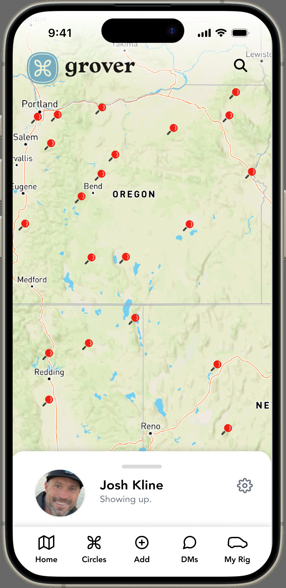

# Image Optimization Recommendations

## Critical Issues to Fix (from PageSpeed Insights):

### 1. Hero Image (`img/hero-phone.jpg`) - 266 KiB savings possible
- **Current**: 290.2 KiB (863x1771 pixels)
- **Displayed as**: 268x550 pixels
- **Action needed**: 
  - Create optimized WebP version: `img/hero-phone.webp`
  - Create smaller JPEG for smaller screens: `img/hero-phone-mobile.jpg` (268x550)
  - Update HTML to use `<picture>` element with responsive sources

### 2. Grover Chat Avatar - 1,072 KiB savings possible
- **Current**: 1,073.1 KiB from `ops.getgrover.ai/api/files/2de8f6a5-586d-455b-8dfd-b13eb2998098`
- **Displayed as**: 60x60 pixels 
- **Action needed**: This is controlled by the Grover chat embed
  - Contact Grover API team to optimize this avatar image
  - Should be maximum 60x60 pixels and WebP format (~5-10 KiB)

## Recommended Implementation:

### Hero Image HTML Update:
```html
<picture>
  <source media="(max-width: 768px)" srcset="img/hero-phone-mobile.webp" type="image/webp">
  <source media="(max-width: 768px)" srcset="img/hero-phone-mobile.jpg" type="image/jpeg">
  <source media="(min-width: 769px)" srcset="img/hero-phone.webp" type="image/webp">
  <source media="(min-width: 769px)" srcset="img/hero-phone.jpg" type="image/jpeg">
  
</picture>
```

### Tools for Image Optimization:
- **WebP conversion**: Use `cwebp` tool or online converters
- **JPEG optimization**: Use `jpegoptim` or online tools
- **Batch processing**: Consider using `imagemin` or similar tools

### Expected Performance Gains:
- **Hero image optimization**: ~266 KiB savings
- **Chat avatar fix**: ~1,072 KiB savings  
- **Total**: ~1,338 KiB savings (matches PageSpeed estimate)

This should significantly improve the PageSpeed Insights score from 59 to 75-85+.