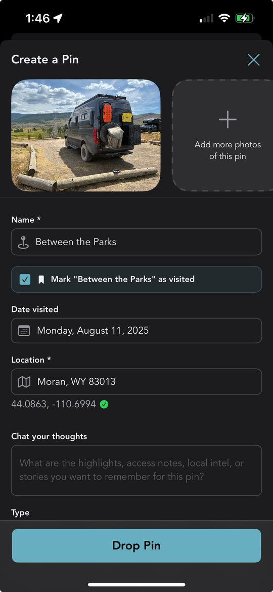

<nav class="nav-menu">

Jump to:
<ul class="nav-links">
<li><a href="#the-other-half">The Other Half</a></li>
<li><a href="#how-it-works">How It Works</a></li>
<li><a href="#why-it-matters">Why It Matters</a></li>
<li><a href="#try-it">Try It</a></li>
</ul>

</nav>

<main class="blog-container">
<header class="blog-header">
<h1 class="blog-title">Grover Now Catches Bucket List Matches As You Go</h1>

Published July 14, 2026 · 5 min read

Tags: bucket list · pin creation · community map · Grover features · trip memories

</header>

<article class="blog-content">

Drop a pin near a spot you'd bucket-listed, and Grover already knows.

<section id="the-other-half">

We told you about <a href="../grover-bucket-list-pin-creation" class="cta-link">the loop that closes when you tap a bucket list marker</a> — you visit the spot you'd planned for, upload a photo, and Grover turns your dream into a real pin on the map. That flow is great, but it asks something of you: you have to remember the marker was there, find it, and tap it.

Here's the other half of the loop. Sometimes you don't tap your bucket list marker at all. You just drop a pin the normal way, from wherever you happen to be, because you found a great spot and want to share it. Maybe you forgot you'd bucket-listed something nearby. Maybe you never even opened your bucket list that day. It didn't matter — until now, that connection just got lost.

Grover doesn't let it get lost anymore. Every time you create a brand-new pin, the app quietly checks whether you're standing near a spot you'd already dreamed about. If you are, it tells you, right there in the pin creation form, before you even hit save.

</section>

<section id="how-it-works">
<h2>How the Match Shows Up</h2>

Start a pin the way you always do: drop it on the map, add your photo, fill in the details. Nothing about the normal flow changes. But if that new pin lands within 500 meters of one of your planned bucket list spots, something extra appears on the form.

You'll see a checkbox with the exact name of the matching spot, something like <strong>Mark "Between the Parks" as visited</strong>. It's checked by default, because we'd bet you want it checked. If more than one bucket list spot happens to be nearby, you'll see a checkbox for each one, so nothing gets missed.

There's a small, thoughtful touch here too. If your new pin doesn't have a name yet, Grover borrows the name from the nearby bucket list spot and fills it in for you. One less field to type, one more reason the app feels like it's paying attention.

<strong>Within 500 meters of a planned spot, a checkbox appears, pre-checked by default.</strong> Leave it checked and saving your pin also marks that bucket list spot visited, complete with your photo and location. Uncheck it, and your bucket list spot stays untouched — the choice is always yours.

Save the pin once your photo finishes uploading, and Grover handles the rest quietly in the background. Any checked spot gets marked visited using the same photo and location you just shared. No extra screens, no separate confirmation, no second trip through your bucket list.

</section>

<section id="why-it-matters">
<h2>Why It Matters</h2>

A bucket list is a promise you made to yourself, and promises are easy to forget once the miles start rolling by. You plan a route around three or four dream spots, then the trip takes on a life of its own. You find yourself somewhere unexpected, snap a photo, drop a pin — and the spot you'd planned for weeks ago sits there in your bucket list, technically unfinished, even though you just lived the moment that finished it.

That's the gap this feature closes. It doesn't ask you to remember your own plans. It remembers for you, and it hands you the credit the instant it's earned.

<blockquote>
"Closing the loop shouldn't take a second trip through your bucket list. If you're standing there, Grover already knows."
</blockquote>

Paired with the tap-the-marker flow from our last update, this means there's no longer a "right way" to complete a bucket list spot. Tap the marker if you remember it. Drop a fresh pin if you don't. Either path gets you to the same satisfying result: a dream that's officially done, and a new pin the community gets to discover.

</section>

<section id="try-it">
<h2>Give It a Reason to Fire</h2>

This feature only shows up when you've got planned spots nearby, so the best way to see it in action is to build out your bucket list before your next trip. New spots to add just landed too — check out the <a href="../grover-campflare-campgrounds" class="cta-link">Campflare campground partnership</a> for a fresh batch of places worth planning around.

Once you're on the road, you don't have to do anything differently. Drop pins the way you always have. If you happen to land near a spot you'd dreamed about, Grover will tell you, pre-checked and ready to go. And if you're not sure what's nearby or want help deciding where to go next, remember that <a href="../grover-chat-knows-where-you-are" class="cta-link">chat now knows where you are</a>, so your agent can point you toward planned spots without you having to ask twice.

Every completed spot adds to your growing collection too. Check your <a href="../grover-stats-and-trophies" class="cta-link">Stats & Trophy page</a> after your next drive and watch the numbers move. And once you've got a pin worth showing off, <a href="../grover-circles-club-sharing" class="cta-link">share it with your Circle</a> in one tap — the people who'll actually appreciate that dream-spot photo are usually the ones already following your trip.

</section>

<section class="related-articles" style="margin: 40px 0; padding: 30px; background: #f8f9fa; border-radius: 15px; border-left: 4px solid #66AEC0;">
<h3 style="color: #66AEC0; margin-bottom: 20px;">More from The Joy Ride Journal</h3>

<h4 style="margin-bottom: 5px;"><a href="../grover-bucket-list-pin-creation" class="cta-link">From Dream to Done: How Grover Turns Your Bucket List into a Pin</a></h4>

The other half of this same loop — tap your bucket list marker on site and Grover kicks off pin creation for you.

<h4 style="margin-bottom: 5px;"><a href="../grover-campflare-campgrounds" class="cta-link">Grover Partners with Campflare to Bring You More Campgrounds</a></h4>

A fresh source of spots worth adding to your bucket list before your next trip.

<h4 style="margin-bottom: 5px;"><a href="../grover-chat-knows-where-you-are" class="cta-link">Your Grover Chat Now Knows Where You Are</a></h4>

Location-aware chat makes it even easier to find and plan around nearby bucket list spots.

<h4 style="margin-bottom: 5px;"><a href="../grover-stats-and-trophies" class="cta-link">Your Vanlife Story, in Numbers: Meet Grover's Stats & Trophy System</a></h4>

Every completed bucket list spot adds to your growing trophy collection.

<h4 style="margin-bottom: 5px;"><a href="../grover-circles-club-sharing" class="cta-link">Your People, Your Pins: Introducing Club Circles on Grover</a></h4>

Just completed a bucket list spot? Share the pin with your Circle in one tap.

</section>

<strong>Don't have this yet?</strong> Make sure automatic updates are turned on in the App Store or Google Play so Grover updates itself the moment new features ship — no need to check back and update manually.

<h3>Let Grover Catch the Moment</h3>

Download Grover, build out your bucket list, and let the app close the loop the instant you get there — whether you remember to tap the marker or not.

<a href="https://apps.apple.com/us/app/grover-van-life/id6742468326" class="cta-button" style="margin-top: 0;">Download on the App Store</a>
<a href="https://play.google.com/store/apps/details?id=ai.getgrover.grover_mobile_app" class="cta-button" style="margin-top: 0;">Get it on Google Play</a>

</article>
</main>
