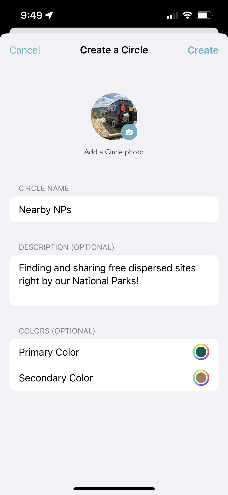
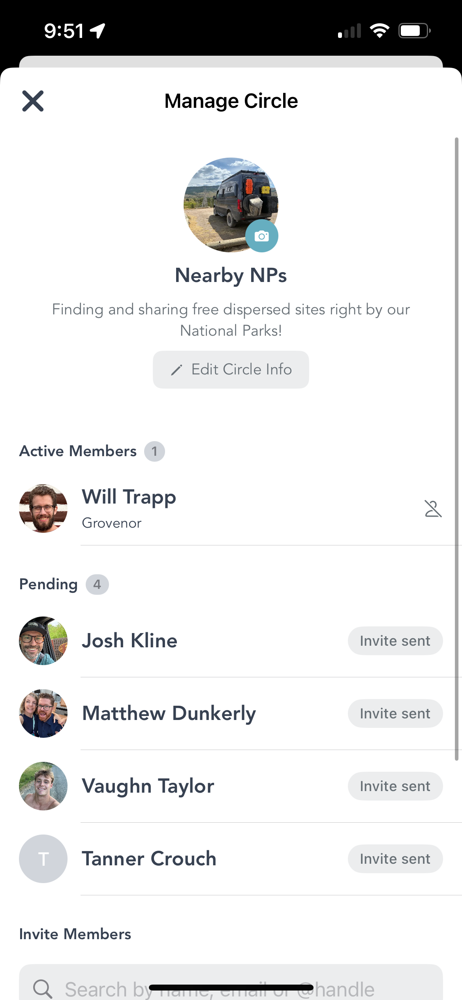
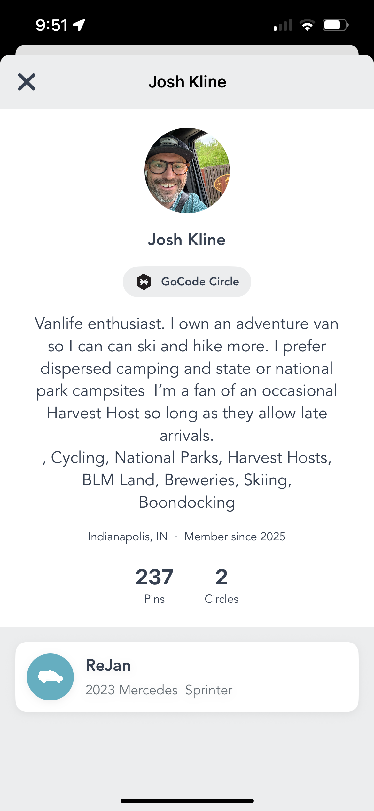

<nav class="nav-menu">

Jump to:
<ul class="nav-links">
<li><a href="#home-circle">From One Circle to Many</a></li>
<li><a href="#create">Create Your Circle</a></li>
<li><a href="#share">Share in One Tap</a></li>
<li><a href="#grovenor">The Grovenor</a></li>
<li><a href="#profiles">Find Your People</a></li>
</ul>

</nav>

<main class="blog-container">
<header class="blog-header">
<h1 class="blog-title">Your People, Your Pins: Introducing Club Circles on Grover</h1>

Published June 23, 2026 · 5 min read

Tags: app features · social · circles · community · public profiles

</header>

<article class="blog-content">

Vanlife is better when you share it with the right people. The hidden dispersed site that requires local knowledge. The sketchy mountain pass someone in your rig-specific group flagged last week. The perfect beach pullout your friends found and dropped a pin on before the crowd showed up. That information doesn't need to go to everyone — it needs to go to your people.

We've been building toward this for a while. And now it's here: Club Circles on Grover.

<section id="home-circle">
<h2>From One Circle to Many</h2>

When Grover launched, every user was part of one Home Circle. It was the community — everyone sharing with everyone. That was the right start. It got pins flowing, got conversations going, and showed us just how much people want to share what they find on the road.

Then we created the Grover Circle — a universal space for the whole community. For a few months, that was the world. One big shared map where every pin landed in one place. It worked. But we kept hearing the same thing: <em>"I want to share this with my crew, not the whole internet."</em>

So we built that. Club Circles let you create or join as many Circles as you want — each one its own little community with its own focus, its own people, and its own pins. Your Grover Circle is still there. Your Home Circle is still there. But now you can stack as many Club Circles on top as you'd like.

</section>

<section id="create">
<h2>Create Your Circle</h2>

Creating a Circle takes about thirty seconds. Tap the Circles tab. At the top, you'll see a scrollable row of all your current Circles. The first chip in that row says <strong>+ Join</strong>. Tap it.

From there, you can browse public Circles to join — or create your own. To build a new one, you'll pick a name, upload a photo, write a description, and choose your colors. That's the whole form.

The Create a Circle form — name, photo, description, and colors. Done in under a minute.

The name and description are how people will discover you if you make the Circle public. The colors are just for you — they theme your Circle's look across the app. Pick something that fits the vibe.

<strong>Theme ideas that work well:</strong> a rig-specific crew (Transit owners, Sprinter nerds, Class B crew), a region you explore together (desert Southwest, Pacific Coast, Great Lakes), an activity focus (skiing, climbing, dispersed camping), or just the people you always want to know about first.

</section>

<section id="share">
<h2>Share in One Tap</h2>

Here's the part that makes Club Circles genuinely useful on the road. You find an incredible spot. You snap a photo. You upload a pin. And at that moment, you pick which Circle it goes to.

One tap. Your Circle sees it. Nobody else has to.

That's the promise of Club Circles — not just a group chat, but a shared map that grows with every trip every member takes. When someone in your Circle posts a dispersed site near a national park, it shows up on your map. When you find the perfect overnight pullout, it lands on theirs. The map gets better every time anyone in your group goes out.

<blockquote>
"Find an amazing place, snap a photo, upload a pin, and with one tap it's shared with your Circle."
</blockquote>

You can also request to join existing public Circles you discover. If the Circle is open to new members, the Grovenor will see your request and can let you in. More on that below.

</section>

<section id="grovenor">
<h2>The Grovenor</h2>

Every Circle has one. The person who created it is the Grovenor — yes, that's a real thing we named on purpose, and yes, we're proud of it.

The Manage Circle screen — Active Members, pending invites, and the search bar to invite new people.

The Grovenor has a few specific powers. They can invite new members by name, handle, or email. They can accept (or decline) requests from people who want to join. And if someone's being a bad actor in the group — not sharing kindly, not contributing well — the Grovenor can remove them.

The Manage Circle screen shows you everything at once: active members, pending invites, pending requests. You can search for anyone on Grover to send an invite directly. If they're already in your network, they'll show up immediately.

<strong>A note on community:</strong> Circles work best when they're built on trust. Invite people who'll contribute, share generously, and treat shared spots with respect. In all things — on the road and on Grover — be kind.

</section>

<section id="profiles">
<h2>Find Your People</h2>

Club Circles are only as good as the people in them. So alongside Circles, we've launched public profiles — a way to find out who you're sharing with before you invite them, and a way for friends to find you.

A public Grover profile — bio, location, stats, Circle affiliations, and rig details all in one place.

Your public profile shows your handle, your bio, where you're based, how long you've been on Grover, how many pins you've contributed, how many Circles you're part of, and your rig. It's a quick read that tells someone whether you're the kind of vanlife nerd they want in their Circle.

Tap anyone's avatar in a feed, a member list, or a search result to pull up their profile. If they look like your kind of people, invite them in.

To make sure your own profile is ready: sharpen up your avatar, set your handle, and make sure your <a href="../getting-started-with-grover-guide" class="cta-link">rig specs</a> and stats reflect everything you've been up to. Your profile is how the community sees you — make it count.

</section>

Grover has always been about sharing the road. Club Circles just give you the tools to share it with exactly the right people, exactly when it matters. Go create yours.

<section class="related-articles" style="margin: 40px 0; padding: 30px; background: #f8f9fa; border-radius: 15px; border-left: 4px solid #66AEC0;">
<h3 style="color: #66AEC0; margin-bottom: 20px;">More from The Joy Ride Journal</h3>

<h4 style="margin-bottom: 5px;"><a href="../grover-bucket-list-pin-creation" class="cta-link">From Dream to Done: How Grover Turns Your Bucket List into a Pin</a></h4>

Once you're in a Circle, this is what you're sharing. A look at how pin creation and bucket list completion work together.

<h4 style="margin-bottom: 5px;"><a href="../grover-stats-and-trophies" class="cta-link">Your Vanlife Story, in Numbers: Meet Grover's Stats & Trophy System</a></h4>

The stats that show up on your public profile — and the trophies you earn along the way.

<h4 style="margin-bottom: 5px;"><a href="../grover-in-app-tutorial-system" class="cta-link">Grover Now Teaches You the App While You Use It</a></h4>

New to Grover? The in-app tutorial walks you through everything — including where Circles fit in.

<h4 style="margin-bottom: 5px;"><a href="../getting-started-with-grover-guide" class="cta-link">Getting Started with Grover: Your Complete Guide</a></h4>

Everything from download to first adventure — the full orientation for new Grover members.

</section>

<h3>Ready to Build Your Circle?</h3>

Download Grover, tap the Circles tab, and create the group you've been missing. Your people are already out there — time to find them.

<a href="https://apps.apple.com/us/app/grover-van-life/id6742468326" class="cta-button" style="margin-top: 0;">Download on the App Store</a>
<a href="https://play.google.com/store/apps/details?id=ai.getgrover.grover_mobile_app" class="cta-button" style="margin-top: 0;">Get it on Google Play</a>

</article>
</main>
