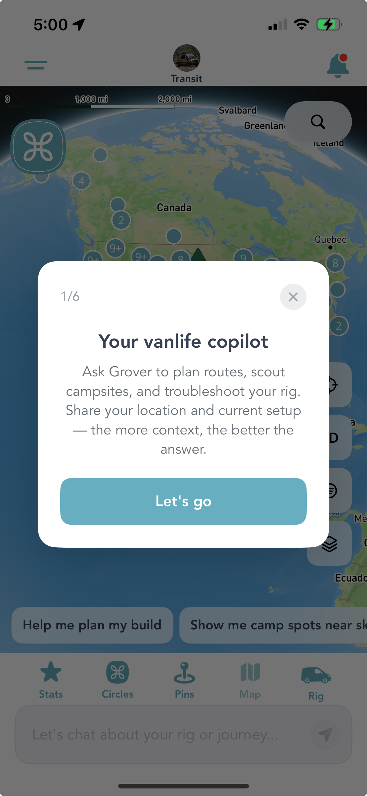
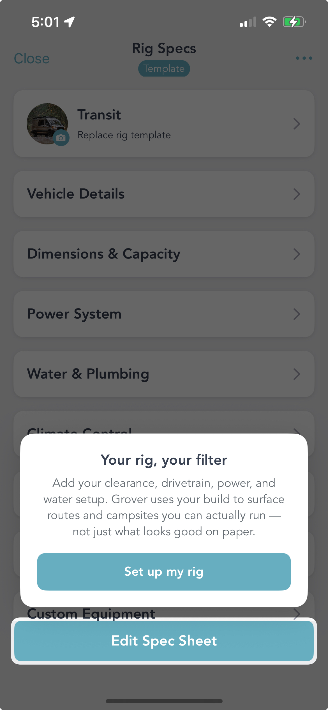
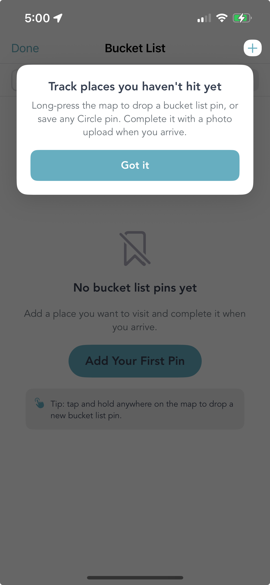

<nav class="nav-menu">

Jump to:
<ul class="nav-links">
<li><a href="#copilot">Your Copilot</a></li>
<li><a href="#rig">Rig as Filter</a></li>
<li><a href="#bucket-list">Bucket List</a></li>
<li><a href="#six-steps">The 6-Step Flow</a></li>
<li><a href="#for-you">What This Means</a></li>
</ul>

</nav>

<main class="blog-container">
<header class="blog-header">
<h1 class="blog-title">Grover Now Teaches You the App While You Use It</h1>

Published June 17, 2026 · Updated June 19, 2026 · 5 min read

Tags: app features · onboarding · vanlife copilot · rig setup · bucket list

</header>

<article class="blog-content">

Grover has a lot going on. There's the map packed with community pins, LandTrust properties, and bucket list markers. There's the AI copilot that plans routes, scouts campsites, and troubleshoots your rig on demand. There's your Rig Specs sheet — the thing that filters every result to what your specific build can actually handle. And then there's Circles, Stats, the Trophy Map, pin creation, and more.

That's a lot of power. And power without a guide is just noise.

So we built one. Grover now ships with a six-step in-app tutorial that meets you exactly where you are — in the real app, on the real features, at the moment you're ready to use them. No wall of onboarding text. No simulated interface. Just a spotlight on the actual thing, and a single sentence that tells you why it matters.

<section id="copilot">
<h2>Step 1: Meet Your Vanlife Copilot</h2>

The tutorial opens on the map screen — which is where most people land when they first open Grover and think "okay, now what?" The first overlay answers that question directly.

Step 1 of 6: the AI copilot introduction on the Grover map screen.

<strong>"Your vanlife copilot."</strong> Ask Grover to plan routes, scout campsites, and troubleshoot your rig. Share your location and current setup — the more context, the better the answer.

That's it. One card, one button, one clear idea. The tutorial doesn't try to explain everything the AI can do — it just gives you enough to start the conversation. You tap "Let's go" and you're in. The copilot handles the rest from there.

<strong>Context is everything.</strong> The more Grover knows — your location, your rig, your planned route — the sharper its answers get. The tutorial is built around this idea: give you just enough to start sharing context, and let the AI take it from there.

</section>

<section id="rig">
<h2>Your Rig Is the Filter</h2>

Here's the thing about vanlife trip planning apps: most of them show you everything and let you figure out what applies to you. A beautiful campsite that requires a 38-foot approach road. A forest route with a 4-inch clearance. A spot that needs shore power and you're running solar-only.

Grover does something different. It uses your rig specs to filter results before they surface. That means what you see is what you can actually run — not just what looks good on paper.

The Rig Specs tutorial introduces your vehicle as Grover's core filter engine.

The tutorial makes this explicit. When you land on the Rig Specs screen, an overlay reads: <em>"Your rig, your filter. Add your clearance, drivetrain, power, and water setup. Grover uses your build to surface routes and campsites you can actually run — not just what looks good on paper."</em>

You can fill in Vehicle Details, Dimensions &amp; Capacity, Power System, Water &amp; Plumbing, Climate Control, and Custom Equipment. The more you add, the tighter Grover's results get. A Transit van and a 40-foot fifth wheel are not looking for the same campsites — and Grover knows the difference once you tell it what you're driving.

<blockquote>
"Add your clearance, drivetrain, power, and water setup. Grover uses your build to surface routes and campsites you can actually run — not just what looks good on paper."
</blockquote>
</section>

<section id="bucket-list">
<h2>The Bucket List: Places You Haven't Hit Yet</h2>

Every vanlife person has a mental list. That ridge in Colorado. That beach in Baja. That forest road someone mentioned once in a Facebook group and you'll be damned if you can find the post again. Grover gives that list a home.

The Bucket List tutorial explains long-press pin dropping and photo completion.

The Bucket List tutorial walks you through the core gesture: <strong>long-press anywhere on the map to drop a bucket list pin.</strong> You can also save any Circle pin directly to your list. When you finally make it to that spot, you complete the marker with a photo upload — turning a future goal into a documented memory.

It's a small thing that becomes a big thing the longer you use Grover. After a few trips, your bucket list starts looking like a map of your life's ambitions. After a few completions, it starts looking like a record of everything you've actually done.

<strong>Tip embedded in the tutorial:</strong> tap and hold anywhere on the map to drop a new bucket list pin. You don't need to find a specific menu or location first — just hold, drop, done.

</section>

<section id="six-steps">
<h2>Six Steps, Zero Friction</h2>

The full tutorial is a six-step flow. The copilot intro, the rig setup, the bucket list — and three more moments that guide you through the features that unlock the most value in Grover. The sequence moves forward as you engage with each step, and you can dismiss any card if you already know what you're doing.

The spotlight overlays point at the real interface. There's no fake mockup, no separate "tutorial mode." When the card highlights a button, you tap it and it does the real thing. You're not learning a simulation of Grover — you're learning Grover by using it.

Each overlay is one idea. One headline. One short sentence. One button. That's the whole thing. We kept it tight on purpose: the goal is to get you doing, not reading. The moment you tap "Got it" or "Let's go," you're already using the feature the card was pointing at.

</section>

<section id="for-you">
<h2>What This Means If You're New</h2>

If you downloaded Grover recently, the tutorial is your on-ramp. You'll see the overlays as you navigate for the first time. Follow the sequence and by the time you've tapped through all six steps, you'll have set up your rig, started a conversation with your copilot, and dropped your first bucket list pin. That's not a bad first session.

If you've been using Grover for a while, we'll surface tutorial moments when new features land — contextually, in the part of the app where they live. You'll know something new is there and exactly how to use it before you have to go looking.

And if you want to go deeper before your first trip, our <a href="../getting-started-with-grover-guide" class="cta-link">Getting Started guide</a> covers everything in one place.

</section>

We've put a lot of care into making Grover feel intuitive from the first minute. The tutorial is the most direct expression of that — because the best vanlife app in the world is only useful if you know where to start. Now you do. Open the app and let it show you the rest.

<section class="related-articles" style="margin: 40px 0; padding: 30px; background: #f8f9fa; border-radius: 15px; border-left: 4px solid #66AEC0;">
<h3 style="color: #66AEC0; margin-bottom: 20px;">More from The Joy Ride Journal</h3>

<h4 style="margin-bottom: 5px;"><a href="../getting-started-with-grover-guide" class="cta-link">Getting Started with Grover: Your Complete Guide</a></h4>

The full orientation — from download to your first adventure planned. A great companion to the in-app tutorial.

<h4 style="margin-bottom: 5px;"><a href="../your-first-chat-grover-guide" class="cta-link">Your First Chat: What to Ask Grover for Maximum Vanlife Joy</a></h4>

Once you've met your copilot, here's how to actually get the most out of the conversation.

<h4 style="margin-bottom: 5px;"><a href="../grover-bucket-list-pin-creation" class="cta-link">From Dream to Done: How Grover Turns Your Bucket List into a Pin</a></h4>

A deeper look at the bucket list feature the tutorial walks you through.

<h4 style="margin-bottom: 5px;"><a href="../vanlife-app-features-that-matter" class="cta-link">Vanlife App Features That Actually Matter</a></h4>

What separates genuinely useful vanlife apps from the ones that just look good on the shelf.

</section>

<h3>Start the Tutorial</h3>

Download Grover and let the six-step tutorial walk you through everything that matters. Your rig, your bucket list, your copilot — all set up in one first session.

<a href="https://apps.apple.com/us/app/grover-van-life/id6742468326" class="cta-button" style="margin-top: 0;">Download on the App Store</a>
<a href="https://play.google.com/store/apps/details?id=ai.getgrover.grover_mobile_app" class="cta-button" style="margin-top: 0;">Get it on Google Play</a>

</article>
</main>
