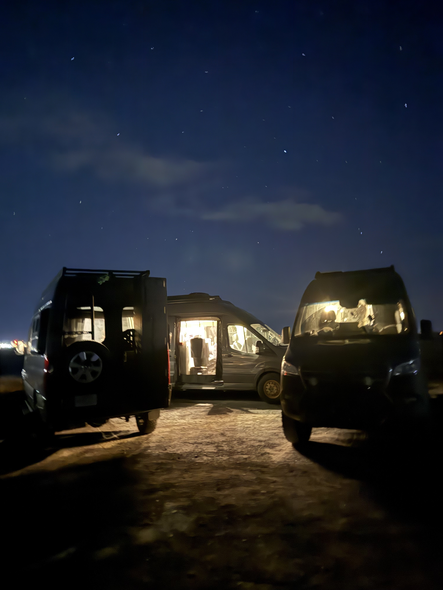

<nav class="nav-menu">

Jump to:
<ul class="nav-links">
<li><a href="#why">Why It Matters</a></li>
<li><a href="#vehicle">Vehicle Details</a></li>
<li><a href="#dimensions">Dimensions</a></li>
<li><a href="#power">Power</a></li>
<li><a href="#water">Water</a></li>
<li><a href="#faq">FAQ</a></li>
</ul>

</nav>

<main class="blog-container">
<header class="blog-header">
<h1 class="blog-title">Van Build Specs: The Numbers Every Van Owner Should Know</h1>

Published August 11, 2026 · 8 min read

Tags: van build · specs · electrical · water · tires · checklist

</header>

<article class="blog-content">

Ask a room full of van owners how tall their van is. Most will say "about ten feet" and then look at the ceiling. Ask how many usable amp hours are in the battery bank and you get the number printed on the batteries, which is a different number. Ask how long they can sit still before the grey tank forces a move and you get shrugs.

That isn't a sign of a bad build. A conversion is dozens of decisions made over months, and nobody hands you a summary at the end. Here are the numbers worth knowing by heart, and where to find each.

<section id="why">
<h2>Why Your Own Numbers Beat the Brochure Numbers</h2>

The first thing that goes wrong is hesitation. You're at the mouth of a parking garage with a fan and a rack on the roof and you have to decide right now. Knowing your real height means you commit or you back out without an audience.

The second is quieter. Advice about your van is only as good as what the person giving it knows about your van. Generic guidance on heaters, tires, and battery sizing sounds convincing and turns out wrong often enough to cost money.

<strong>The habit worth building:</strong> write each number down the first time you find it. You will need it again, at the worst possible moment, with no cell service.

</section>

<section id="vehicle">
<h2>1. Vehicle Details</h2>

Start with the chassis. Year, make, model, and trim, plus the parts people skip: wheelbase, roof height as ordered, engine and fuel type, and drivetrain.

Wheelbase is not trivia. A 144-inch Sprinter and a 170-inch Sprinter are different vehicles for campsite length limits and for turning around on a forest road. Fuel type decides which heaters are on the table. Drivetrain decides how much road you should attempt.

Where to find it: the VIN sits at the base of the windshield on the driver's side and repeats on the driver door jamb sticker. That sticker is the most useful label on your van and almost nobody reads it. Photograph it today. It carries tire sizes, cold pressures, and the weight ratings below.

</section>

<section id="dimensions">
<h2>2. Dimensions and Capacity</h2>

<h3>Your true height, not the spec-sheet height</h3>

Published height describes an empty van with a bare roof. You don't drive that van. Yours has a fan, maybe an air conditioner, maybe solar on standoffs, maybe a rack with an awning hanging off it.

Measure it. Level ground, van loaded, because a full water tank settles the suspension. Find the actual highest point, usually an AC shroud or a rack rail, and measure straight down to the pavement. Add two or three inches of margin, then write that in feet and inches on tape stuck to the driver's visor.

Urban parking structures commonly post six and a half to seven feet. Drive-throughs and car washes often sit under nine. Some national park tunnels post combined height and width limits requiring a paid escort, so check the park's restrictions page first.

<h3>Length, width, and the space you occupy</h3>

Know your bumper-to-bumper length and your width with the mirrors out, since mirrors are what make narrow forest roads interesting. Campgrounds publish a maximum vehicle length per site, often well under thirty feet. Inside, measure standing height, real sleeping length, and your side door opening.

<h3>Weight, the number people skip</h3>

Your jamb sticker lists GVWR, the most your loaded van may weigh, and a GAWR for each axle. Payload is GVWR minus what your van actually weighs. A conversion often eats most of it before you pack a thing, and water runs 8.3 pounds per gallon, so a full 30-gallon tank is roughly 250 pounds of cargo.

Go weigh it. A CAT scale at a truck stop costs a few dollars and gives you front axle, rear axle, and gross weight in five minutes. Do it fully loaded, then compare each axle to its GAWR. An overloaded rear axle is a brake and tire problem long before it's a legal one.

<table>
<thead>
<tr>
<th>Number</th>
<th>Where to find it</th>
</tr>
</thead>
<tbody>
<tr>
<td>VIN, GVWR, GAWR, tire size and pressures</td>
<td>Driver door jamb sticker</td>
</tr>
<tr>
<td>Curb weight and factory dimensions</td>
<td>Manufacturer spec sheet for your year and trim</td>
</tr>
<tr>
<td>True loaded weight per axle</td>
<td>CAT scale at a truck stop</td>
</tr>
<tr>
<td>True height, interior height, bed length</td>
<td>Tape measure, van loaded, level ground</td>
</tr>
<tr>
<td>Tank sizes, battery capacity, appliance models</td>
<td>Builder invoice or the labels on the components</td>
</tr>
</tbody>
</table>
</section>

<section id="power">
<h2>3. Power System</h2>

<h3>Amp hours versus watt hours</h3>

Capacity gets quoted in amp hours, and amp hours alone tell you little. 100 Ah at 12 volts holds about 1,200 watt hours. 100 Ah at 24 volts holds about 2,400. Same label, twice the energy. Appliances are rated in watts, so multiply amp hours by system voltage and write down the watt hours.

<h3>Usable capacity, not nameplate capacity</h3>

Chemistry decides how much of that you get to spend. Lead acid and AGM banks last longer when you use roughly the top half, so a 200 Ah AGM bank behaves like 100 Ah. Lithium iron phosphate tolerates much deeper daily use. Identical labels, very different nights.

<h3>The rest of the system</h3>

<ul>
<li><strong>Inverter continuous and surge watts.</strong> Compare that to your biggest load. Induction cooktops and hair dryers routinely ask for 1,500 watts or more, and a small inverter simply refuses.</li>
<li><strong>Solar array watts and controller model.</strong> Nameplate watts are a noon-in-summer best case with clean panels and no shade. Note the controller's input limits before you add a panel.</li>
<li><strong>Alternator or DC-DC charger amps,</strong> which is how much a driving day gives back, and your shore inlet rating, 15, 20, or 30 amps.</li>
<li><strong>Daily consumption in watt hours.</strong> Add up fridge, fan, lights, pump, laptop, and internet gear. Most people find the fridge is the whole conversation.</li>
</ul>

When part of that chain misbehaves, model numbers you already wrote down turn an afternoon of guessing into a targeted fix. Our <a href="../van-electrical-systems-troubleshooting-guide" class="cta-link">van electrical systems troubleshooting guide</a> walks through the common failures.

</section>

<section id="water">
<h2>4. Water and Plumbing</h2>

Fresh capacity gets the attention. Grey capacity usually ends the stay.

Write both in gallons, plus your toilet setup: cassette, black tank, or composting head. Cooking and dishes without a shower runs roughly two to four gallons per person per day, and a real shower doubles that fast. Divide fresh by your daily rate for a ceiling.

Then check grey. Most builds hold less grey than fresh, which makes grey the real limit. Knowing which one runs out first is the difference between planning a dump stop and needing one.

Also record water heater type and capacity, pump flow rate, filter type and last change date, and where the low drain point is for winterizing. If any plumbing runs through unheated space, learn that now rather than during a freeze. Our <a href="../vanlife-toilets-complete-guide-expert-knowledge" class="cta-link">guide to vanlife toilets</a> covers the tradeoffs if you're still choosing.

</section>

<section id="climate">
<h2>5. Climate Control</h2>

For heat, record the type, the output in BTU or kilowatts, and the fuel source. An air heater pulling from the vehicle tank has a different range story than one on a small dedicated tank. Combustion heaters also care about elevation, and some need a high-altitude setting to burn cleanly at 9,000 feet. Our <a href="../complete-guide-van-heating-systems" class="cta-link">guide to van heating systems</a> goes deep on the categories.

For cooling, record any air conditioner's BTU rating and its current draw, then compare that against your usable watt hours. That comparison is how many hours of AC you actually have. Note your roof fan's CFM and whether it reverses, since exhaust and intake solve different problems. Our <a href="../vanlife-air-conditioning-fans-expert-cooling-guide" class="cta-link">air conditioning and fans guide</a> covers the rest.

Two lines nobody writes down: where your carbon monoxide and propane detectors are mounted, and when you last tested them.

</section>

<section id="kitchen">
<h2>6. Kitchen and Living</h2>

Record your fridge's capacity and its daily energy use, since it's usually your largest continuous load. Note your cooktop fuel, and for propane, the tank size and whether you refill or exchange it, because that changes where you can stop.

Write your bed's real measurements instead of a mattress marketing size. Count your seatbelted seats, because that number, not your floor space, sets how many people can legally ride with you. Our <a href="../complete-guide-vanlife-refrigeration-keep-food-fresh" class="cta-link">guide to vanlife refrigeration</a> is a good next read.

</section>

<section id="exterior">
<h2>7. Exterior and Recovery</h2>

This is the section that decides whether that forest service road is a good idea.

<ul>
<li><strong>Tire size, load range, and date code.</strong> Load range matters on a heavy van, and rubber ages on a calendar rather than an odometer. The four-digit sidewall code gives week and year of manufacture. Note the pressures you actually run against the cold pressures on the jamb sticker.</li>
<li><strong>Spare tire size and location,</strong> plus the jack, the lug wrench, and your wheel torque spec.</li>
<li><strong>Drivetrain reality.</strong> Rear-wheel drive on dry maintained gravel is fine. Wet clay, deep sand, and steep washouts are not. Know whether you have all-wheel drive, four-wheel drive with low range, or a locking differential, and know that none of it adds ground clearance.</li>
<li><strong>Your lowest point.</strong> Crawl under and look. It's often a step, a tank skid, or a hitch receiver rather than the differential. That's what finds the rock.</li>
<li><strong>Rated recovery points,</strong> because tie-down loops are not them, and airing down for sand only works if you can air back up.</li>
<li><strong>Roof rack load rating and awning length,</strong> both of which feed back into that height number.</li>
</ul>
</section>

<section id="custom">
<h2>8. Custom Equipment</h2>

Every build has a handful of things that fit nowhere else. Suspension changes and how much lift they added. Swivel seats. Satellite internet. A GMRS radio. Extra lighting.

Record the make, model, and serial number for anything with a warranty or a support line. That's the first thing a manufacturer asks for and the last thing you can find in the dark.

Then stop. A partly filled sheet beats a perfect one you never finish.

</section>

<section id="one-place">
<h2>Once You Know Your Numbers, Keep Them Somewhere Useful</h2>

A spec sheet buried in your email is barely better than no spec sheet. The point is that the numbers are reachable while you're standing in a hardware store aisle or parked at a trailhead.

Grover keeps that sheet inside the app. The <strong>Rig</strong> button opens Rig Hub, and the <strong>Specs</strong> tile holds a sheet organized into the same eight sections this guide follows, from Vehicle Details through Custom Equipment. Fill in what you know, leave the rest for later, and the tile shows how many of the eight have something in them.

Your rig assistant has been reading that sheet all along. What Rig Hub adds is the view. The tile puts a number on how much of your own build you have actually written down, and that number is usually what gets people to go fill in the rest. A fuller sheet means more specific answers, and it gives Grover more to match against when it points you at <a href="../grover-glovebox-document-recommendations" class="cta-link">the documentation that exists for your rig</a>. Your spec sheet is the thing being read, which is this whole post in one sentence.

Our <a href="../grover-rig-hub" class="cta-link">walkthrough of Rig Hub</a> covers what lives behind each tile, <a href="../getting-started-with-grover-guide" class="cta-link">the getting started guide</a> is the shortest path in, and <a href="../ultimate-guide-vanlife-apps" class="cta-link">our ultimate guide to vanlife apps</a> puts it in context.

</section>

<section id="faq">
<h2>Frequently Asked Questions</h2>

<h3>How do I find out how tall my van is?</h3>

Measure it rather than looking it up. On level ground, find the highest point including your fan, air conditioner, solar, or rack, and measure straight down to the pavement. Add two or three inches of margin, then write that on tape on your sun visor.

<h3>What is the difference between amp hours and watt hours?</h3>

Amp hours only compare fairly within the same system voltage. Watt hours describe energy outright. Multiply amp hours by system voltage: 200 Ah at 12 volts is about 2,400 watt hours. Appliances are rated in watts, so watt hours are what let you plan a day.

<h3>How much water do I need per day in a van?</h3>

Cooking and dishes without a shower lands around two to four gallons per person per day, and showers push that up fast. Divide your fresh tank by that rate, then check grey, because grey is smaller in most builds and it decides when you move.

<h3>What is payload and how do I find mine?</h3>

Payload is your GVWR minus what your van actually weighs. Get GVWR from the door jamb sticker, then weigh the van fully loaded at a truck stop CAT scale. Check each axle against its GAWR too, since a van can sit under its gross rating while the rear axle is over.

</section>

Set aside an hour this week. Tape measure, phone camera, door jamb, component labels, and a trip to a scale. Then go read our <a href="../ultimate-vanlife-knowledge-base-expert-answers" class="cta-link">vanlife knowledge base</a> with your own numbers in hand. Few hours you spend on your van pay off as reliably as the one where you finally learn what you built.

<section class="related-articles" style="margin: 40px 0; padding: 30px; background: #f8f9fa; border-radius: 15px; border-left: 4px solid #66AEC0;">
<h3 style="color: #66AEC0; margin-bottom: 20px;">More from The Joy Ride Journal</h3>

<h4 style="margin-bottom: 5px;"><a href="../grover-rig-hub" class="cta-link">Rig Hub: One Place for Everything About Your Build</a></h4>

Where your spec sheet, your rig assistant, and your Glovebox live inside the Grover app.

<h4 style="margin-bottom: 5px;"><a href="../van-electrical-systems-troubleshooting-guide" class="cta-link">Van Electrical Systems Troubleshooting Guide</a></h4>

Diagnose the most common 12-volt failures without guessing, from charge controllers to inverters.

<h4 style="margin-bottom: 5px;"><a href="../ultimate-vanlife-knowledge-base-expert-answers" class="cta-link">The Ultimate Vanlife Knowledge Base</a></h4>

Expert answers across heating, cooling, power, water, and everything else that breaks.

<h4 style="margin-bottom: 5px;"><a href="../vanlife-app-features-that-matter" class="cta-link">Vanlife App Features That Actually Matter</a></h4>

Why recommendations built around your specific rig beat generic search every time.

</section>

<h3>Ready to put your numbers in one place?</h3>

Grover gives your build a spec sheet across all eight sections, then uses it to make answers about heaters, power, water, and tires specific to your van instead of generic.

<a href="https://apps.apple.com/us/app/grover-van-life/id6742468326" class="cta-button" style="margin-top: 0;">Download on the App Store</a>
<a href="https://play.google.com/store/apps/details?id=ai.getgrover.grover_mobile_app" class="cta-button" style="margin-top: 0;">Get it on Google Play</a>

</article>
</main>
