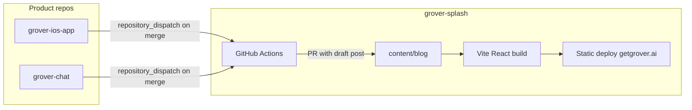

# feat: Modernize getgrover.ai for three audiences with new IA, stack, and commit-driven blog

## Summary

Rebuild getgrover.ai as a modern, audience-aware marketing site on the React/Vite/Tailwind stack prototyped in the external **Grover's Enhanced Site** project, while preserving the existing image catalogue, partner logos, brand typography, and select illustration assets. Replace the current single-scroll homepage and ad-hoc page sprawl with a clear three-audience information architecture (DIY app users, van/RV manufacturers, component OEMs), copy grounded in real product capabilities from `grover-ios-app` and `grover-chat`, App Store 1.1.2 screenshots as primary product visuals, and a commit-triggered blog pipeline that turns shipping work in product repos into publishable updates.

---

## Problem Frame

getgrover.ai is still a hand-maintained static HTML marketing site: one long animated homepage, no persistent global navigation, `build/` and `tutorials.html` funnels that do not reflect current product surfaces, and twenty-six SEO-oriented blog posts that are largely disconnected from what the app and platform actually ship today. A separate Lovable prototype (**Grover's Enhanced Site**) already demonstrates the desired direction—fixed nav, hero, feature grid, app showcase, and a **For Brands** page with analytics mockups—but it lives outside this repo and is not wired to production, real screenshots, or a blog automation story.

Marketing must speak truthfully to three buyers at once: vanlifers who download the app and configure a rig-specific AI assistant; manufacturers who white-label Grover-powered communities and need confidence/insights for their customers; and component OEMs (e.g. Infinity, Rixens) who publish engineering knowledge into Grover to power assistants. Without a structural overhaul, every product release in iOS or chat/backend repos forces manual site edits, and navigation cannot route visitors to the right story.

The tactical plan in `docs/plans/2026-04-21-001-feat-grova-unification-and-site-rework-plan.md` (Grova assistant unification, CSP, `stamp-blog.js`) remains valid infrastructure work. **Complete any unfinished units from that plan first** (or in parallel with Phase 0 below) so analytics, CSP, and assistant IDs do not regress during the larger migration.

---

## Requirements

- R1. **Three-audience IA** — Every primary visitor type has a dedicated entry path: consumers (`/`), manufacturers (`/for-builders` or equivalent), component OEMs (`/for-oems` or equivalent). Global navigation exposes all three plus Blog and App Download CTAs.
- R2. **Capability-accurate copy** — All feature claims on marketing pages map to shipped or actively-flagged capabilities evidenced in `grover-ios-app` and `grover-chat` commit history (see Capability Inventory below). No resurrected S.A.M. branding; Grova/Grover assistant language only where product uses it.
- R3. **Visual modernization** — Adopt Enhanced Site layout patterns (fixed nav, card-based features, app screenshot carousel/grid, partner logo wall, analytics section for B2B). Retain Grover color tokens (`#66aec0` primary, yellow accent, Plantin heading font where feasible).
- R4. **Asset retention** — Keep `img/partner-logos/`, `img/marketing/`, `img/print-materials/`, hero illustrations (`img/*Graphic.svg`), combomarks, favicons, and `img/og.png`. Migrate App Store Finals **1.1.2** PNGs into `public/` (or `img/app/`) as the canonical product screenshot set.
- R5. **Navigation rework** — Persistent header on all marketing routes; mobile drawer; primary CTA = App Store + Android where available; secondary CTA = "Talk to us" / HubSpot or `mailto:` for B2B (match existing lead capture if any).
- R6. **Page consolidation** — Explicit keep/migrate/redirect/retire decisions for every current URL (see Site Inventory). Reduce duplicate funnels; do not maintain parallel static and React versions of the same page long term.
- R7. **Commit-driven blog** — Merges to `main`/`dev` in `grover-ios-app` and `grover-chat` that match conventional `feat`/`fix` prefixes can trigger draft blog posts via GitHub Actions; human approval before publish. Existing HTML posts remain reachable via redirect or archive tier.
- R8. **SEO & redirects** — `sitemap.xml`, canonical URLs, OG images, and 301 redirects for retired paths. Blog slug stability for high-traffic legacy URLs where possible.
- R9. **Deploy compatibility** — Production host remains static-friendly (GitHub Pages / `CNAME` for getgrover.ai): Vite `build` outputs to deploy root; blog can remain pre-rendered HTML or MD→HTML in CI.
- R10. **Partner marketing kit** — `partner-marketing.html` remains available (possibly moved to `/partners/copy-kit` or passwordless internal path) for brand partners; not linked from consumer nav.

**Actors**

| ID | Audience | Job to be done |
|----|----------|----------------|
| A1 | DIY van/RV owner | Download app, set up rig-aware AI, plan trips, save/share spots |
| A2 | Van/RV manufacturer | Launch branded assistant + owner community, see usage/topics, deliver post-sale confidence |
| A3 | Component OEM | Publish KB content so Grover answers with their engineering/support truth |
| A4 | Grover marketing | Ship site updates without hand-editing 26 HTML files |

**Key flows**

- F1. Consumer: landing → feature proof (screenshots) → App Store / Play Store → optional Grover Chat embed on site
- F2. Manufacturer: landing → analytics/insights story → partner logos → contact/demo CTA
- F3. OEM: landing → knowledge-base value prop → Infinity/Rixens-style proof → contact CTA
- F4. Blog: product commit merged → CI drafts post → editor approves → static publish → sitemap update

---

## Capability Inventory (source of truth for copy)

Derived from recent `feat`/`fix` commits in product repos. Marketing may simplify language but must not claim capabilities absent from this list without a product sign-off.

### Consumer app (`grover-ios-app`)

| Theme | Shipped capabilities (marketing hooks) |
|-------|----------------------------------------|
| AI assistant | Rig-specific chat, themed UI per assistant, minimap in conversations, welcome/prompt bubbles |
| Map & pins | Community/circle pins, pin types (paid/urban/dispersed), layers (MVUM roads, BLM, NFS), long-press bucket list save, pin feed with share, builder attribution badges |
| Bucket list | Save places with photos, location picker, distance rules, swipe delete, yellow map pins |
| Circles | Per-circle map visibility, circle feed, avatars in picker |
| Trip / rig | Rig specs in app, directions via Apple/Google Maps |
| Platforms | iOS App Store; Android open beta (per chat invite work—verify store URLs before hero CTA) |

### Platform / chat (`grover-chat`)

| Theme | Shipped capabilities (marketing hooks) |
|-------|----------------------------------------|
| Assistants | Custom assistants per company, PATCH/deep-merge config, rig spec templates |
| Knowledge | Company KB permissions, KB dashboard (sessions, topics, keywords), public KB routes |
| Pins API | Bucket list pins end-to-end, presigned uploads, influence stats, circle pin search |
| Manufacturer tools | Dashboard endpoints (invites, FAQ, notifications, rig templates), reports/topics |
| Invites | Dual store badges, magic links, branded invite pages |

Use this table as the **copy checklist** when writing Features, How It Works, and audience pages.

---

## Site Inventory (keep / migrate / redirect / retire)

| Current path | Recommendation | Notes |
|--------------|----------------|-------|
| `/` (`index.html`) | **Migrate → React home** | Replace scroll-maze with Enhanced Site sections; keep hero van SVG/video optional as “brand moment” strip, not entire page |
| `/blog/*` (26 posts) | **Tier** | Tier A (product guides mentioning Grover): refresh + new template. Tier B (state SEO): archive or noindex + redirect to `/blog`. Tier C: 301 to relevant hub |
| `/blog/` index | **Migrate** | Card grid driven from `content/blog/manifest.json` |
| `/build/` | **Retire → redirect** | Fold “build your assistant” into consumer story + app download; Grova embed only on `/try` if needed |
| `/tutorials.html` | **Retire → redirect** | Merge into `/blog` or `/help` hub |
| `/partner-marketing.html` | **Keep, relocate** | `/partners/copy-kit` — no main nav link |
| `/terms/` | **Keep** | Port layout shell only |
| `/pages/account-delete/` | **Keep** | Legal; minimal chrome |
| `main.js` scroll effects | **Retire** | Replace with lighter CSS scroll animations in React |
| `sw.js` | **Revisit** | Likely drop or narrow precache after Vite hashed assets |

---

## Scope Boundaries

- Does not include building the manufacturer **dashboard product UI** (lives in grover-chat); marketing only screenshots/mockups with permission.
- Does not rewrite all 26 legacy blog posts by hand in v1; automation + tiering handles bulk, editorial refresh is phased.
- Does not change App Store listing copy (only uses assets from Drive folder locally).
- Does not add new backend APIs; blog automation uses GitHub APIs and static files only.
- HubSpot/forms: reuse existing embeds if present; replacing CRM is out of scope.

### Deferred to Follow-Up Work

- Full editorial rewrite of Tier A legacy posts
- Interactive demo (embedded live chat session) beyond existing Grover Chat widget
- Localized/non-English marketing
- `/ce-work` execution of Enhanced Site import (this plan only)

### Deferred for later (product)

- Web-based assistant builder replacing native onboarding
- Self-serve manufacturer signup without sales touch

---

## Key Technical Decisions

1. **Stack: Vite + React + TypeScript + Tailwind + shadcn** — Import from **Grover's Enhanced Site** as the base; merge into `grover-splash` on a feature branch rather than maintaining two repos. Use `react-router-dom` SPA with **static export** (`vite build` + `base: '/'`) for GitHub Pages compatibility.

2. **Monorepo layout inside grover-splash** — Move marketing app to repo root or `site/`:
   - `src/` — React app (from Enhanced Site)
   - `public/` — static assets (migrated `img/`, fonts, app screenshots)
   - `content/blog/` — MDX or Markdown + frontmatter
   - `scripts/` — blog generators (extend `stamp-blog.js` or replace)
   - Legacy static files removed only after redirects ship

3. **Audience routes (proposed)**

   | Route | Page | Primary CTA |
   |-------|------|-------------|
   | `/` | Consumer home | Download app |
   | `/for-builders` | Manufacturers (expand `ForBrands.tsx`) | Book demo / contact |
   | `/for-oems` | Component KB partners (new) | Contact partnerships |
   | `/blog` | Journal index | — |
   | `/blog/:slug` | Post | App download inline |
   | `/try` | Optional Grova web embed | Open chat |
   | `/partners/copy-kit` | Moved partner-marketing | — |

4. **Navigation model** — Desktop: logo | For Vanlifers (/) | For Builders | For OEMs | Blog | [Download] [Contact]. Mobile: sheet menu. Footer: Terms, Privacy, Blog, Partners (B2B), socials.

5. **Blog automation** — GitHub Actions in `grover-splash` triggered by `repository_dispatch` from `grover-ios-app` and `grover-chat` (on merge to `main`), or scheduled poll of release notes:
   - Input: commit message, SHA, repo, author
   - Filter: conventional commits `feat(scope):` and notable `fix(scope):`
   - Output: PR adding `content/blog/YYYY-MM-DD-slug.md` from template + optional “What it means for you” section
   - Human merges PR → CI runs `npm run build:blog` → updates `blog/manifest.json` and static HTML export

6. **Legacy blog** — Generate `public/blog/legacy/*.html` redirects via build script mapping old filenames → new slugs or `/blog` hub to preserve SEO.

7. **Visual assets** — Copy App Store 1.1.2 PNGs from Google Drive into `public/img/app/1.1.2/` (optimize with `sharp` in CI). Enhanced Site placeholder screenshots replaced with these files. Keep SVG illustrations as section accents on consumer page only.

8. **Analytics & embeds** — Carry forward GA4 (`G-LN0EK30SS7`), Grover Chat init in `<head>` with Grova assistant ID `3eb69271-d883-440b-944c-c40afa7725df`, and CSP rules from the April 2026 plan.

9. **Brand page content** — `ForBrands.tsx` becomes **For Builders**: emphasize white-label communities, owner confidence, KB-backed answers, dashboard insights (topics, sessions, keywords). New **For OEMs** page: Infinity/Rixens logos from `img/partner-logos/`, “your manuals and support history power every assistant,” engineering/troubleshooting accuracy.

10. **Android CTA** — Confirm Play Store URL from latest `feat(invite): launch Android open beta` deploy before adding second store badge to hero.

---

## High-Level Technical Design

> Directional guidance for review, not implementation specification.

### System context



### Consumer page composition (replace index.html scroll stack)

1. Hero — Enhanced Site hero + App Store CTAs + optional looping phone video from `img/demo2.mp4`
2. Features — 4 cards mapped to Capability Inventory (AI, Map/Circles, Bucket list, Trip planning)
3. App showcase — 4–6 screenshots from App Store 1.1.2 set
4. How it works — 4 steps (sign up → chat → discover/share → enjoy)
5. Social proof — partner logo strip (existing SVGs)
6. CTA band — download + chat teaser
7. Footer

Optional: single “brand delight” band reusing animated van SVG from current hero (reduced motion respected).

### Blog post schema (Markdown frontmatter)

```yaml
title: string
date: ISO date
slug: string
audience: consumer | builder | oem | all
product_repo: grover-ios-app | grover-chat | both
commit_sha: string
tags: string[]
summary: string
draft: boolean
legacy_redirect_from: string[]  # optional old HTML paths
```

---

## Output Structure (target repo layout)

```text
grover-splash/
├── src/
│   ├── components/       # Nav, Hero, Features, …
│   ├── pages/            # Index, ForBuilders, ForOems, BlogPost, …
│   └── assets/brands/    # partner SVGs (from img/partner-logos)
├── public/
│   ├── img/              # migrated catalogue + app/1.1.2/
│   └── fonts/
├── content/blog/         # Markdown source
├── scripts/
│   ├── generate-blog-from-commit.js
│   ├── build-blog-html.js
│   └── migrate-legacy-blog.js
├── .github/workflows/
│   ├── deploy-site.yml
│   └── blog-from-product-commit.yml
├── docs/plans/
└── (legacy files removed after cutover)
```

---

## Phased Delivery

| Phase | Outcome | Depends on |
|-------|---------|------------|
| **0** | Finish April 2026 tactical plan (Grova, CSP, GA) | — |
| **1** | Import Enhanced Site; Vite build; deploy preview | 0 |
| **2** | Asset migration (img + App Store shots); design tokens | 1 |
| **3** | Global nav + three audience routes + copy from Capability Inventory | 2 |
| **4** | Blog MD pipeline + manifest + new index | 1 |
| **5** | GHA cross-repo blog dispatch + PR workflow | 4 |
| **6** | Legacy redirects, sitemap, cutover, retire old index | 3, 5 |
| **7** | Editorial pass Tier A posts; OEM case studies | 6 |

---

## Implementation Units

### U1. Complete tactical foundation (April 2026 plan)

**Goal:** Ensure Grova assistant, CSP, GA, and `stamp-blog` baseline are done before or during migration.

**Requirements:** R2, R9 (partial)

**Dependencies:** None

**Files:** `index.html`, `build/index.html`, `.htaccess`, `scripts/stamp-blog.js`, `package.json`, `sw.js` — per `docs/plans/2026-04-21-001-feat-grova-unification-and-site-rework-plan.md`

**Approach:** Execute remaining unchecked units from that plan; do not duplicate work.

**Test scenarios:** CSP console clean on home + blog; single Grova ID site-wide; `npm run stamp-blog` idempotent.

**Verification:** Manual smoke on staging; no duplicate GA loads.

---

### U2. Bootstrap Vite/React app from Enhanced Site

**Goal:** Replace hand-rolled static homepage development with the Lovable prototype codebase inside `grover-splash`.

**Requirements:** R3, R9

**Dependencies:** U1 (recommended)

**Files:** `package.json`, `vite.config.ts`, `tailwind.config.ts`, `src/**`, `index.html` (Vite entry), `tsconfig*.json`, `components.json`

**Approach:** Copy Enhanced Site `src/`, config files, and dependencies; set `base: '/'` and `build.outDir` to `dist/`; add `npm run dev`, `npm run build`, `npm run preview`. Wire existing `CNAME` deploy to publish `dist/`.

**Patterns to follow:** Enhanced Site `Navigation.tsx`, `Index.tsx`, `ForBrands.tsx` structure.

**Test scenarios:**
- Happy path: `npm run build` succeeds with zero TS errors
- Edge: production build asset paths resolve on GitHub Pages (`/img/...` not broken)
- Error: missing env does not break static build

**Verification:** Preview deploy loads `/` and `/for-brands`.

---

### U3. Migrate static asset catalogue

**Goal:** Preserve all marketing images and fonts under `public/` with stable URLs.

**Requirements:** R4

**Dependencies:** U2

**Files:** `public/img/**` (from `img/`), `public/fonts/**`, update import paths in React components

**Approach:** `git mv img public/img` (or copy + phased delete); copy App Store 1.1.2 PNGs from Drive into `public/img/app/1.1.2/`; run image optimization script (optional `sharp` devDependency). Map `src/assets/brands/*` to `public/img/partner-logos/*` to avoid duplication.

**Test scenarios:**
- All partner logos render on builder page
- App showcase uses ≥4 real 1.1.2 screenshots
- Print-materials and marketing SVGs remain reachable at documented paths for external PDF links

**Verification:** Visual checklist against current site partner grid.

---

### U4. Design system alignment

**Goal:** Match Grover brand (Plantin headings, primary teal, yellow accent) across shadcn theme.

**Requirements:** R3

**Dependencies:** U2, U3

**Files:** `src/index.css`, `tailwind.config.ts`, `index.html` font preload

**Approach:** Port CSS variables from `main.css` / critical inline styles on current `index.html`; preload `fonts/PlantinInfantBold`; map shadcn `--primary` to `#66aec0`.

**Test scenarios:** Hero H1 uses heading font; contrast passes WCAG AA on primary button

**Verification:** Side-by-side screenshot with current homepage header.

---

### U5. Global navigation and footer

**Goal:** Ship persistent nav/footer across all React routes.

**Requirements:** R1, R5

**Dependencies:** U4

**Files:** `src/components/Navigation.tsx`, `src/components/Footer.tsx`, `src/App.tsx`

**Approach:** Extend Enhanced Site nav with three audience links + Download CTA; add Footer with Terms (`/terms` static), Blog, B2B contact. Mobile sheet from existing shadcn patterns.

**Test scenarios:**
- Desktop: all nav links route correctly
- Mobile: menu opens, traps focus, closes on navigate
- Download goes to correct App Store URL

**Verification:** Playwright or manual cross-route check.

---

### U6. Consumer homepage (migrate Index)

**Goal:** Launch `/` with accurate capability copy and App Store showcase.

**Requirements:** R1, R2, R3

**Dependencies:** U5, U3

**Files:** `src/pages/Index.tsx`, `src/components/Hero.tsx`, `Features.tsx`, `AppShowcase.tsx`, `HowItWorks.tsx`, `Community.tsx`, `CTA.tsx`

**Approach:** Rewrite feature and showcase strings from **Capability Inventory**; replace placeholder screenshots; optional保留 one illustration (`loveVanGraphic.svg`) in Community section; retire scroll-path SVG from old home or move to optional component with `prefers-reduced-motion`.

**Test scenarios:**
- No mention of S.A.M.
- Each feature card maps to at least one inventory row
- Hero shows dual store badges only when Android URL confirmed

**Verification:** Product team sign-off on copy doc vs inventory table.

---

### U7. Manufacturers page (For Builders)

**Goal:** `/for-builders` converts van/RV manufacturers with insights + white-label story.

**Requirements:** R1, R2

**Dependencies:** U5, U3

**Files:** `src/pages/ForBuilders.tsx` (rename from `ForBrands.tsx`), analytics images, `src/App.tsx` route

**Approach:** Reframe copy: “Build quickly, give customers confidence, branded circles, KB-backed answers, dashboard topics/sessions.” Use Enhanced Site analytics PNGs; partner logo grid from migrated SVGs; CTA to HubSpot or `mailto:sales@…`.

**Test scenarios:**
- Page cites dashboard insights only where `feat(kb-dashboard)` features exist
- Logos match current production partner set

**Verification:** B2B stakeholder review.

---

### U8. Component OEM page (new)

**Goal:** `/for-oems` targets Infinity, Rixens, and similar suppliers.

**Requirements:** R1, R2

**Dependencies:** U7

**Files:** `src/pages/ForOems.tsx` (new), `src/App.tsx`

**Approach:** Sections: problem (generic troubleshooting), solution (company KB + permissions), proof (OEM logos, quote placeholders), how content flows into assistants, CTA. Cross-link to `/for-builders` for OEMs who also build vans.

**Test scenarios:**
- Infinity and Rixens logos displayed with correct alt text
- Copy does not claim OEM-only features not in `feat: knowledge base company permissions`

**Verification:** Partnerships team review.

---

### U9. Retire and redirect legacy funnels

**Goal:** Remove confusing duplicate entry points.

**Requirements:** R6, R8

**Dependencies:** U6

**Files:** `_redirects` or `public/_redirects`, `scripts/generate-redirects.js`, remove or stub `build/index.html`, `tutorials.html` after cutover

**Approach:** `/build/` → `/` or `/try`; `/tutorials.html` → `/blog`; document in `docs/site-redirects.md`.

**Test scenarios:** Each old URL returns 301 to intended target

**Verification:** `curl -I` checks on staging.

---

### U10. Markdown blog pipeline

**Goal:** New posts authored in `content/blog/` with shared layout.

**Requirements:** R7, R8 (partial)

**Dependencies:** U2

**Files:** `content/blog/`, `scripts/build-blog-html.js`, `src/templates/blog-post.html` or Astro-like MDX compile step, `blog/manifest.json`

**Approach:** Use `marked` or `vite-plugin-md` to emit static HTML into `dist/blog/`; shared header/footer via template; consume manifest for index page React or static `BlogIndex.tsx`.

**Test scenarios:**
- New MD post appears on `/blog` after build
- Frontmatter `draft: true` excluded from production
- RSS optional later

**Verification:** Create sample post, build, open in preview.

---

### U11. Commit-triggered blog drafts (cross-repo)

**Goal:** Product repo merges open draft blog PRs in grover-splash.

**Requirements:** R7

**Dependencies:** U10

**Files:** `.github/workflows/blog-from-product-commit.yml`, `scripts/generate-blog-from-commit.js`, templates in `content/blog/_template.md`

**Approach:** Add `repository_dispatch` types `ios_shipped`, `chat_shipped` with payload `{ message, sha, repo }`. Workflow filters conventional commits; opens PR with generated MD; labels `blog-draft`. Document webhook setup in `grover-ios-app` and `grover-chat` (separate PRs in those repos).

**Test scenarios:**
- `feat(bucket-list):` message produces draft with bucket list copy
- `chore:` commit does not trigger
- Re-run same SHA does not duplicate PR

**Verification:** Dry-run `workflow_dispatch` with fixture payload.

---

### U12. Legacy blog tiering and redirects

**Goal:** Preserve SEO while shrinking maintenance.

**Requirements:** R6, R8

**Dependencies:** U10

**Files:** `scripts/migrate-legacy-blog.js`, `content/blog/redirects.json`, update `sitemap.xml` generation

**Approach:** Classify 26 HTML posts: Tier A (6–8 Grover product guides) → convert to MD; Tier B (state community SEO) → `noindex` + canonical to `/blog` hub; generate redirect map. Keep `stamp-blog.js` only until legacy HTML retired.

**Test scenarios:**
- Tier A URLs either unchanged or 301 to same slug
- Tier B URLs redirect without 404 chains

**Verification:** Crawl staging sitemap; compare Search Console top URLs before cutover.

---

### U13. Partner copy kit relocation

**Goal:** Keep `partner-marketing.html` useful without polluting consumer IA.

**Requirements:** R10

**Dependencies:** U5

**Files:** `public/partners/copy-kit/index.html` (moved from root), internal README link

**Approach:** Move as-is HTML or port shell to React without redesign; exclude from sitemap priority.

**Verification:** Existing partner bookmarks work via redirect.

---

### U14. Deploy workflow and cutover

**Goal:** Production serves Vite `dist/` at getgrover.ai.

**Requirements:** R9

**Dependencies:** U6–U12

**Files:** `.github/workflows/deploy-site.yml`, `CNAME`, `.htaccess` or CDN headers for SPA fallback

**Approach:** Build on push to `main`; deploy `dist/`; SPA fallback only for non-file routes; blog as static files. Bump cache headers. Remove or narrow `sw.js`.

**Test scenarios:**
- Cold load home < 3s on 4G (target, not gate)
- Chat widget initializes on consumer pages
- `terms/` and `account-delete` still reachable

**Verification:** Production smoke after DNS cutover.

---

### U15. Legal and utility pages

**Goal:** Terms and account deletion remain compliant.

**Requirements:** R6

**Dependencies:** U2

**Files:** `public/terms/index.html`, `pages/account-delete/index.html` or port into `public/`

**Approach:** Minimal React shell or leave as static HTML in `public/`.

**Test scenarios:** Pages load without requiring JS bundle for account-delete

**Verification:** Legal review unchanged.

---

## System-Wide Impact

| Surface | Impact |
|---------|--------|
| getgrover.ai visitors | New IA; many URLs redirected |
| Product repos | Optional dispatch webhook; no runtime dependency |
| Partners | Copy kit URL change only |
| SEO | Temporary ranking fluctuation possible during redirects |
| Grover Chat embed | Must remain CSP-allowed on new pages |

---

## Risk Analysis & Mitigation

| Risk | Mitigation |
|------|------------|
| SEO loss on 26 legacy blogs | Tier redirects; keep top URLs; monitor Search Console |
| GitHub Pages SPA 404 on refresh | `404.html` hack or explicit HTML per route for blog |
| Copy drift from product | Capability Inventory + commit blog template |
| Dual-repo Enhanced Site drift | Import once; archive external prototype |
| Android URL not public | Ship iOS-only CTA until confirmed |
| Large image repo size | Optimize App Store PNGs in CI |

---

## Success Metrics

- Three audience pages live with shared nav and &lt;5s understood value prop (qualitative user test)
- ≥1 blog post/week generated from product commits (after webhook enabled) with &lt;15 min editor time
- Legacy 404 rate &lt;1% for 30 days post-cutover (server logs)
- App Store CTR from site measurable in GA4 events (if `download` click events added)

---

## Open Questions

### Resolve before implementation

1. **Canonical B2B contact** — HubSpot form URL, Calendly, or email for builder/OEM CTAs?
2. **Android Play Store URL** — Production link for hero badge?
3. **Enhanced Site repo** — One-time import vs. submodule? (Recommend one-time copy.)
4. **Tier B legacy blogs** — Archive with redirect vs. leave indexed with noindex?

### Deferred to implementation

- Exact slug map for all 26 legacy posts
- Whether `/try` hosts full Grova embed or links to `ops.getgrover.ai`
- Image optimization targets (WebP vs PNG)

---

## Relationship to April 2026 Plan

| April plan focus | This plan |
|------------------|-----------|
| Grova ID, CSP, GA, stamp-blog | Still required (U1); blog stamp superseded by U10–U12 for new content |
| No visual redesign | Explicit full redesign |
| No partner grid changes | Builder/OEM pages expand partner story |

---

## Sources & References

- External prototype: **Grover's Enhanced Site** (Lovable/Vite/React) — import `src/pages/Index.tsx`, `ForBrands.tsx`, components
- App Store assets: Google Drive `Art/App Store Assets/App Store Finals/1.1.2/` (21 PNGs, May 2026)
- Product capabilities: `grover-ios-app` and `grover-chat` git history (May 2026)
- Prior plan: `docs/plans/2026-04-21-001-feat-grova-unification-and-site-rework-plan.md`
- Current production: `index.html`, `blog/`, `partner-marketing.html`, `build/index.html`
