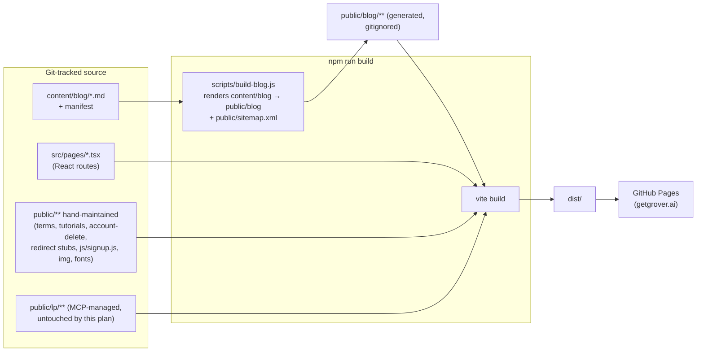

# feat: Finish the grover-splash site migration

## Summary

The May 2026 modernization plan shipped the React/Vite shell (nav, `/`, `/for-builders`, `/for-oems`, `/partners/copy-kit`) but left its two most load-bearing units undone: the dual root/`public/` HTML mirror was never collapsed, and no markdown blog pipeline was ever built. Both are now actively costing Will time (a recent change needed six file edits for three real changes) and both interact with newly-shipped business-OS infrastructure (owned signup forms, MCP-published `/lp/` landing pages) that must not regress. This plan finishes the migration: kill the dual-copy convention repo-wide, replace the 36 hand-maintained blog post directories with a markdown-source build pipeline that preserves every existing URL, replace the two remaining HubSpot Meetings embeds with Google Calendar appointment schedules, and keep the GitHub Pages deploy contract (including the `public/lp/` MCP passthrough) intact throughout.

---

## Problem Frame

**What actually shipped from the May 2026 plan** (verified against the repo, not assumed — see Audit below): the Vite/React/Tailwind app (`src/`), the three-audience routes (`/`, `/for-builders`, `/for-oems`), global nav/footer, and the partner copy kit moved to a real React route (`/partners/copy-kit`, `src/pages/CopyKit.tsx`) with a redirect stub left at the old URL. `/build/` was retired to a meta-refresh redirect stub. That is real, working progress.

**What did not ship**, despite being marked "completed" in the May plan's frontmatter:

1. **The dual root/`public/` mirror was never removed — it's the opposite of what the plan intended.** `vite.config.ts` uses Vite's default `publicDir` (`public/`) with no override, and `.github/workflows/deploy-site.yml` runs `npm run build` (Vite) then deploys `dist/`. Only `public/` ever reaches production. The root-level `blog/`, `tutorials.html`, `terms/`, `pages/account-delete/`, `partner-marketing.html`, `build/`, `main.css`, `main.js`, `img/`, `fonts/`, `favicon.ico`, `js/`, `sitemap.xml` are **never built or deployed** — they exist purely so a human can open and edit them with working relative paths, then remember to hand-copy every change into the matching `public/` file. This is confirmed drift-prone in practice: `tutorials.html` vs `public/tutorials.html` already differ (spacer height/copy, noted independently in `HANDOFF-business-os.md`), and the just-merged business-OS work had to touch each blog/tutorials file twice (root + `public/`) to land one HubSpot-removal change.
2. **No markdown blog pipeline exists.** `content/blog/`, `scripts/build-blog-html.js`, and `blog/manifest.json` (all named in the May plan's Output Structure) do not exist anywhere in the repo. All 36 posts under `blog/` (35 posts + `index.html`) are hand-authored HTML, each duplicated into `public/blog/`. `scripts/stamp-blog.js` only rewrites a GA snippet across the root `blog/*.html` files — it is not a content pipeline.
3. **The commit-triggered blog draft workflow (U11) was never built.** No `.github/workflows/blog-from-product-commit.yml`, no `scripts/generate-blog-from-commit.js`.
4. **Legacy blog tiering (U12) never happened** — no posts were archived, noindex'd, or converted; all 35 are still live, hand-maintained HTML.
5. **Two HubSpot Meetings iframes/links still exist** and were missed by the recent HubSpot-removal work (which only covered `hs-form-frame` opt-in forms, per `HANDOFF-business-os.md` U3): `src/components/copy-kit/GroverLinks.tsx` (a `meetings.hubspot.com/will858/grover-success-with-josh` iframe — this is the Customer Success booking link Will asked about in his handoff notes) and the `HUBSPOT_BOOKING_URL` constant (`grover-discovery-and-demo`) used as a plain link in both `src/pages/ForBuilders.tsx` and `src/pages/ForOems.tsx`.

**What must not break while fixing the above:** the `public/lp/<slug>/` MCP publishing contract (grover-chat's `publish_landing_page`/`update_landing_page` tools write directly into `public/lp/` via the GitHub Contents API and interpolate `templates/landing-page.html` — see `docs/plans/2026-07-23-005-feat-owned-forms-and-landing-page-publishing-plan.md`), the owned signup form embeds (`public/js/signup.js` + the `[data-grover-signup]` fragment, currently embedded on `blog/index.html`, the vanlife-toilets post, and `tutorials.html`), and blog URL stability (SEO — 35 posts, several years of accumulated backlinks/rankings).

---

## Audit: May 2026 Plan, Shipped vs. Not

| May plan unit | Status | Evidence |
|---|---|---|
| U1 (tactical foundation: Grova/CSP/GA) | Shipped | GA4 (`G-LN0EK30SS7`) present site-wide; prior handoffs confirm CSP/Grova work landed in earlier cycles |
| U2 (bootstrap Vite/React) | Shipped | `vite.config.ts`, `src/App.tsx`, working `npm run build` |
| U3 (migrate static asset catalogue) | **Partially shipped, in a way that created the current pain** | `public/img/`, `public/fonts/` exist and are used by the build, but the *old* root `img/`, `fonts/`, `main.css` were never deleted — they were meant to be moved (`git mv`), not copied. The leftover root copies are dead weight for the build and a maintenance trap for editors |
| U4 (design system alignment) | Shipped | Tailwind theme, brand colors, Plantin font all present |
| U5 (global nav/footer) | Shipped | `src/components/Navigation.tsx` / `Footer.tsx` (or equivalent) render on all React routes |
| U6 (consumer homepage) | Shipped | `src/pages/Index.tsx` |
| U7 (For Builders) | Shipped | `src/pages/ForBuilders.tsx` |
| U8 (For OEMs) | Shipped | `src/pages/ForOems.tsx` |
| U9 (retire/redirect legacy funnels) | **Partially shipped** | `/build/` retired to a meta-refresh stub (done); `/tutorials.html` was never retired or redirected — it's still live, still linked from `Footer.tsx`, and still hand-duplicated |
| U10 (markdown blog pipeline) | **Not shipped** | No `content/blog/`, no `blog/manifest.json`, no build script; this plan's U2 |
| U11 (commit-triggered blog drafts) | **Not shipped** | No workflow, no script; assessed below (this plan's U3) |
| U12 (legacy blog tiering) | **Not shipped** | All 35 posts still live, untiered |
| U13 (partner copy kit relocation) | **Shipped, and better than planned** | `partner-marketing.html` → redirect stub → real React route `/partners/copy-kit` (`src/pages/CopyKit.tsx`), not just a relocated static file |
| U14 (deploy workflow/cutover) | Shipped | `.github/workflows/deploy-site.yml` builds and deploys `dist/`; `CNAME` = `getgrover.ai` |
| U15 (legal/utility pages) | Shipped, but same dual-copy problem as U3 | `terms/index.html`, `pages/account-delete/index.html` exist in both root and `public/` |

**Bottom line:** the visual/React-shell half of the May plan shipped well. The half that was supposed to *reduce* maintenance burden (asset consolidation, blog pipeline, legacy retirement) did not ship, and the dual-copy pattern it was supposed to kill instead became the repo's ongoing convention (explicitly documented as such in `HANDOFF-business-os.md`'s U2 notes, which describe it as "this repo's existing convention" rather than a bug to fix).

---

## Site Inventory (keep / migrate / retire)

| Surface | Current state | Disposition |
|---|---|---|
| `index.html` (root) | Unique — Vite SPA entry, not duplicated | **Keep as-is.** No `public/index.html` exists; this is the one legitimate root-level file the build actually reads |
| `src/pages/*` (`Index`, `ForBuilders`, `ForOems`, `Download`, `JoinCircle`, `CopyKit`, `NotFound`) | React-routed | **Keep.** No change to routing structure in this plan |
| `blog/` (35 posts + index, root) and `public/blog/` (mirror) | Hand-HTML, duplicated | **Migrate** to `content/blog/*.md` + build-time generation into `public/blog/` (U2). Root `blog/` directory retired entirely once migrated |
| `tutorials.html` (root) and `public/tutorials.html` (mirror, already drifted) | Hand-HTML, duplicated, drifted | **Migrate to single source of truth in `public/` only** (U1). Converting it to a React route is a reasonable future step but out of scope here — no one has asked for it and it works fine as static HTML with the existing `[data-grover-signup]` embed |
| `terms/index.html` and `public/terms/index.html` | Hand-HTML, duplicated, identical | **Migrate to single source in `public/` only** (U1) |
| `pages/account-delete/index.html` and `public/pages/account-delete/index.html` | Hand-HTML, duplicated, identical | **Migrate to single source in `public/` only** (U1) |
| `partner-marketing.html` and `public/partner-marketing.html` | Meta-refresh redirect stub, duplicated, identical | **Migrate to single source in `public/` only** (U1). Already correctly retired in spirit (U13); just needs the dual copy killed |
| `build/index.html` and `public/build/index.html` | Meta-refresh redirect stub, duplicated, identical | **Migrate to single source in `public/` only** (U1) |
| `main.css`, `main.js`, root `img/`, root `fonts/`, root `favicon.ico`, root `js/`, `sw.js`, `.htaccess`, `sitemap.xml`, `llms.txt`, `googlefc0ff7fc8f2aadae.html`, `GA4_TRACKING_SETUP.md`, `IMAGE_OPTIMIZATION_TODO.md` (all root) | Dead weight for the build (Vite never reads root-level static assets); kept only so hand-edited root HTML resolves relative paths locally | **Retire the root copies.** `public/main.css`, `public/img/`, `public/fonts/`, `public/js/`, `public/favicon.ico`, `public/sitemap.xml` remain as the sole copies (U1). `sw.js`, `.htaccess`, `llms.txt`, the two `.md` TODO docs, and `googlefc0ff7fc8f2aadae.html` are evaluated individually in U1 (some are unused legacy, `llms.txt`/Google site-verification stay in `public/` only) |
| `public/lp/<slug>/` | MCP-managed, generated by grover-chat's `publish_landing_page`/`update_landing_page` | **No change.** Explicitly out of scope; this plan must not touch generation, path structure, or the `templates/landing-page.html` contract |
| `templates/landing-page.html` | Single source already (no root mirror) | **No change** |
| `public/js/signup.js` and root `js/signup.js` | Dual copy, by explicit prior convention (`HANDOFF-business-os.md`) | **Migrate to single source in `public/` only** (U1) — this plan's "kill the dual-copy convention" mandate applies here too; the prior work's "matching this repo's existing convention" note is exactly the anti-pattern being retired |

---

## Decisions

Recorded here in place of interactive questions, since this plan was produced non-interactively. Will should double-check each one (flagged again in the final handoff).

1. **Single source of truth = `public/` for everything except blog posts.** Root-level duplicates of static HTML/CSS/JS/assets are deleted outright rather than kept as "canonical editing copies" with `public/` as a generated mirror. Rationale: nothing generates the root copies today (they're hand-edited directly), so there is no technical reason to keep two locations — `public/` already works for local preview via `npm run dev` (Vite serves `publicDir` statically) or any static file server. This is simpler than introducing a sync script that would just be a second thing to remember to run.
2. **Blog posts are the one surface that gets true source/output separation**, because unlike the other static pages they have real per-page content that benefits from a shared template (title/meta/OG tags/nav/footer) and a manifest-driven index — exactly what the May plan intended with `content/blog/` + `blog/manifest.json`. Source lives in `content/blog/*.md` (git-tracked); `public/blog/**` becomes generated build output (gitignored, regenerated by `npm run dev`/`npm run build`), the same treatment already given to `dist/`.
3. **All 35 existing posts are migrated 1:1 to markdown, with no tiering/archiving.** The May plan's Tier A/B/C split (product guides vs. state-SEO vs. archive) was never executed and, on inspection, none of the existing posts look like disposable filler — state-community posts (`vanlife-community-texas`, etc.) and product guides sit alongside each other as real, presumably-still-ranking content. Introducing a tiering judgment call now, without traffic data in hand, risks deleting SEO equity for no clear benefit. **This is the decision most worth Will double-checking** — if Search Console shows some posts get near-zero traffic, a follow-up prune is cheap once the markdown pipeline exists (delete a `.md` file vs. today's two-directory HTML deletion).
4. **U11 (commit-triggered blog drafts) is re-deferred, not built.** The original repository_dispatch design (product repo merge → GitHub Actions → draft PR) is real infrastructure work for a workflow nobody has validated demand for yet. Given the business-OS direction already established (conversational, MCP-tool-driven content actions — see `publish_landing_page` in `docs/plans/2026-07-23-005-...`), if this capability is wanted later it more plausibly belongs as a `create_blog_draft`-style MCP tool Will invokes conversationally (write a `content/blog/*.md` file + commit it via the same GitHub Contents API pattern already proven for `/lp/`) rather than the original cross-repo dispatch design. Recommendation: defer both versions; revisit only if manual posting via Claude/an agent proves to be a real bottleneck. **Second decision worth double-checking** — Will may still want the original cross-repo trigger specifically.
5. **`tutorials.html` stays static HTML** (single-sourced in `public/`), not converted to a React route. It already works with the vanilla-JS signup embed, and no one has asked for it to become a React page. Converting it is a reasonable future item, explicitly deferred.
6. **Google Calendar appointment schedules, not a Calendly-style third party** — Will confirmed Google Calendar directly. Two separate schedules are needed because the two current HubSpot links serve different purposes with different owners: `grover-success-with-josh` (Customer Success, co-founders Will+Josh, embedded iframe on `/partners/copy-kit`) and `grover-discovery-and-demo` (sales/demo, plain link on `/for-builders` and `/for-oems`). Consolidating to one schedule is not assumed; kept as two to preserve the existing distinction.
7. **`sitemap.xml` becomes generated output** (from the blog manifest + a static list of non-blog routes), same treatment as `public/blog/**`, rather than continuing to hand-edit a 5.9KB XML file per new post.

---

## High-Level Technical Design

---

## Implementation Units

### U1. Kill the dual root/`public/` mirror for non-blog static pages

**Goal:** One source of truth (`public/`) for every hand-maintained static surface except blog posts; delete root-level copies that the build never reads.

**Requirements:** Site inventory table above (all "single source in `public/` only" rows); Decision 1.

**Dependencies:** None.

**Files:**
- Delete: root `tutorials.html`, `terms/`, `pages/`, `partner-marketing.html`, `build/`, `main.css`, `main.js`, `img/`, `fonts/`, `favicon.ico`, `js/`, `sitemap.xml` (superseded by U2's generated version), `sw.js` (confirm unused first — see approach), `.htaccess` (confirm still relevant to GitHub Pages hosting; GitHub Pages does not read `.htaccess`, so this is almost certainly dead and safe to delete), `googlefc0ff7fc8f2aadae.html` (verify it's duplicated in `public/` before deleting root copy), `GA4_TRACKING_SETUP.md`, `IMAGE_OPTIMIZATION_TODO.md` (docs, not deploy-relevant — fine to keep at root or move to `docs/`, implementer's call)
- Modify: none inside `public/` — since root and `public/` copies are currently identical (or `public/` is the deployed, therefore authoritative, version where they've drifted, e.g. `tutorials.html`), `public/` versions are kept as-is and become sole source
- Add: a short note in `docs/` (e.g. `docs/site-structure.md`) documenting the resulting convention: "everything under `public/` is the real site; edit it directly; `npm run dev` serves it live; there is no root mirror"

**Approach:** For every duplicated pair, diff root vs. `public/` first (already done for `tutorials.html` and `partner-marketing.html` during planning; repeat for `terms/`, `pages/account-delete/`, `build/`). Where they match, delete the root copy. Where they've drifted (`tutorials.html`), treat `public/` as authoritative (it's what's live in production today) and delete the root copy without merging — the root copy's differences are unintentional drift, not intentional improvements, per `HANDOFF-business-os.md`'s note that this drift predates and is unrelated to any recent deliberate change. Confirm `sw.js` has no remaining registration (`grep -rn "serviceWorker\|sw.js" src/ public/ index.html`) before deleting — the May plan flagged it as "likely drop" and it's unlikely a hashed-asset Vite build still wants a hand-rolled precache list.

**Test scenarios:**
- Happy path: `npm run build` succeeds after deletion; `dist/tutorials.html`, `dist/terms/index.html`, `dist/pages/account-delete/index.html`, `dist/partner-marketing.html`, `dist/build/index.html`, `dist/js/signup.js`, `dist/main.css`, `dist/img/**`, `dist/fonts/**` all present and byte-identical to their `public/` sources (passthrough, unchanged)
- Edge: `npm run dev` locally still renders `/tutorials.html`, `/terms/`, `/pages/account-delete/` correctly with no broken relative asset paths
- Regression: `public/lp/**` and `templates/landing-page.html` untouched; `git diff` on those paths is empty
- Test expectation: none beyond the build/dev smoke checks above — this unit is pure deletion/consolidation, no new logic

**Verification:** `npm run build` clean; manual click-through of `/tutorials.html`, `/terms/`, `/pages/account-delete/`, `/build/` (redirect fires), `/partner-marketing.html` (redirect fires) on the built `dist/` via `npm run preview`.

---

### U2. Markdown-based blog pipeline

**Goal:** Replace 35 hand-maintained HTML post directories with `content/blog/*.md` source, rendered at build time into `public/blog/**`, preserving every existing URL.

**Requirements:** Site inventory (`blog/` row); Decisions 2, 3, 7.

**Dependencies:** U1 (establishes the "no root mirror" convention this unit's output respects — generated files land only in `public/`).

**Files:**
- Add: `content/blog/_template.md` (frontmatter shape reference), one `content/blog/<slug>.md` per existing post (35 files), `content/blog/manifest.json` or a generated equivalent
- Add: `scripts/build-blog.js` — reads `content/blog/*.md`, renders each into `public/blog/<slug>/index.html` using a shared HTML shell (nav/footer/OG-tags matching the current hand-written template, extracted from an existing post as the pattern to follow), regenerates `public/blog/index.html` (card grid) and `public/sitemap.xml`
- Modify: `package.json` (`scripts.build` becomes `node scripts/build-blog.js && vite build`; add a `predev` or equivalent so `npm run dev` also regenerates), `.gitignore` (add `public/blog/**` except keep tracking `public/blog/blog.css` if it isn't also generated, and `public/lp/` stays untouched/unaffected)
- Remove: `scripts/stamp-blog.js` (superseded — GA snippet now lives in the one shared template, not 35 separate files) and its `npm run stamp-blog` script entry
- Remove (after migration verified): root `blog/` directory and `public/blog/**` generated-content files that are no longer git-tracked (retain `public/blog/blog.css` as source input to the template, or fold its rules into the template/shared CSS — implementer's call during migration)

**Approach:** Frontmatter schema per post: `title`, `date`, `slug` (must equal current directory name, e.g. `vanlife-toilets-complete-guide-expert-knowledge`, to preserve URLs), `description` (maps to existing meta/OG description), `og_image` (defaults to `img/og.png` if not overridden), `draft: boolean`. Body content is the existing post's inner HTML/prose converted to markdown (a straightforward mechanical pass per post — extract the content between the shared header/footer chrome already visible in `blog/index.html`'s `<header>`/nav pattern). The signup-form embed (`[data-grover-signup]` fragment, already present on `blog/index.html` and the vanlife-toilets post) is part of the shared template, not per-post content, so it doesn't need to be repeated in every `.md` file. `scripts/build-blog.js` owns: markdown → HTML body, template interpolation (title/description/OG/canonical/body), manifest/index-page generation, sitemap generation. Use a minimal markdown-to-HTML library (e.g. `marked`, already a common lightweight choice; not currently a dependency — add it) rather than hand-rolling a parser.

**Execution note:** Do the template + generator first against 2-3 real posts (including the vanlife-toilets one with the signup form, since it's the trickiest case) before batch-converting the remaining ~32 — this surfaces template gaps early instead of after 35 manual conversions.

**Test scenarios:**
- Happy path: `node scripts/build-blog.js` generates `public/blog/<slug>/index.html` for every post with correct title/description/OG tags/canonical URL matching the original hand-written page
- Happy path: `public/blog/index.html` card grid includes all non-draft posts, sorted by date
- Edge: a post with `draft: true` is excluded from `public/blog/index.html` and from `public/sitemap.xml`, but its `public/blog/<slug>/index.html` file still exists (unpublished-but-not-broken-link is out of scope here — simplest correct behavior is skip from index/sitemap only)
- Edge: slug collision or missing frontmatter field fails the build loudly (clear error) rather than silently emitting a broken page
- Integration: `npm run build` end-to-end produces `dist/blog/**` identical in URL structure to today's production URLs for all 35 posts (spot-check via `find dist/blog -name index.html | wc -l` equals current count, plus explicit path checks for a handful of high-value posts)
- Regression: the signup form embed still renders and points at the correct endpoint on the migrated `blog/index.html` and vanlife-toilets post

**Verification:** Build `dist/`, serve via `npm run preview`, diff rendered HTML of 3-5 migrated posts against the pre-migration versions (title/meta/body content match); confirm `dist/sitemap.xml` lists all posts.

---

### U3. Reassess and re-defer commit-triggered blog drafts (U11)

**Goal:** Formally close out the May plan's U11 with a documented decision rather than leaving it silently unbuilt.

**Requirements:** Decision 4.

**Dependencies:** U2 (any future version of this needs the markdown pipeline to exist first).

**Files:** This plan document only — no code changes. If Will wants to revisit, the follow-up is a new plan, not a unit here.

**Approach:** No implementation in this plan. Record the re-defer decision (already captured in Decisions §4) so a future planner doesn't have to re-derive why U11 was skipped twice.

**Test scenarios:** Test expectation: none — no code produced by this unit.

**Verification:** N/A.

---

### U4. Replace HubSpot Meetings embeds with Google Calendar appointment schedules

**Goal:** Remove the last two HubSpot surfaces on the site (Meetings booking links), closing the gap the recent HubSpot-removal work missed.

**Requirements:** Scope item "Replace remaining HubSpot Meetings embeds"; Decision 6.

**Dependencies:** None (independent of U1-U3; can land in parallel).

**Files:**
- Modify: `src/components/copy-kit/GroverLinks.tsx` (iframe `src`, currently `https://meetings.hubspot.com/will858/grover-success-with-josh?embed=true`)
- Modify: `src/pages/ForBuilders.tsx` (constant `HUBSPOT_BOOKING_URL`, line ~28, currently `https://meetings.hubspot.com/will858/grover-discovery-and-demo`)
- Modify: `src/pages/ForOems.tsx` (constant `HUBSPOT_BOOKING_URL`, line ~6, same value)

**Approach:** Google Calendar's "Appointment schedules" feature (Google Calendar Help, "Share your appointment schedule") supports two embed shapes: an inline iframe (`https://calendar.google.com/calendar/appointments/schedules/<SCHEDULE_ID>?gv=true`) and a "button with popup" snippet, both generated from a schedule's own Share → "Website embed" panel. Manual steps for Will (not code, listed here so they're not lost):
  1. In Google Calendar, create an appointment schedule for Customer Success (co-founders Will + Josh) — replaces `grover-success-with-josh`.
  2. Create a second appointment schedule for sales/demo — replaces `grover-discovery-and-demo`.
  3. For each, open Share → Website embed, and copy the inline-iframe URL (for the Customer Success one, to keep the existing embedded-iframe UX on `/partners/copy-kit`) or the plain booking-page URL (for the discovery/demo one, since `ForBuilders.tsx`/`ForOems.tsx` currently use plain `<a>` links, not iframes — no need to introduce an iframe there, just swap the link target).
  4. Hand the two resulting URLs to whoever implements this unit.
  Code changes are then a straight string swap: rename `HUBSPOT_BOOKING_URL` to something schedule-agnostic (e.g. `BOOKING_URL` or `DISCOVERY_CALL_URL`) in both files and update the iframe `src` in `GroverLinks.tsx`. No new dependency, no new component — same shapes (iframe, plain link) as today, just pointed at Google Calendar instead of HubSpot.

**Test scenarios:**
- Happy path: iframe on `/partners/copy-kit` loads the Google Calendar booking UI (manual visual check — iframes aren't meaningfully unit-testable)
- Happy path: "Book a demo" / discovery links on `/for-builders` and `/for-oems` open the correct Google Calendar booking page in a new tab
- Regression: `grep -ri "hubspot" src/` returns nothing after this unit (currently returns the 3 hits enumerated above)
- Test expectation: no automated test beyond the grep check — this is a static content/link change with no branching logic

**Verification:** Manual click-through on a preview build; `grep -ri "hubspot" src/ public/` clean (only the historical `docs/plans/2026-04-21-...` mention should remain, and only if the search is repo-wide rather than scoped to `src/`/`public/`).

---

### U5. Deploy workflow update for the blog build step

**Goal:** Wire `scripts/build-blog.js` into CI so the deployed site's blog reflects `content/blog/*.md`, without changing the ~2-3 minute deploy latency materially.

**Requirements:** Scope item "Deploy pipeline stays GitHub Pages... keep the public/ passthrough contract for /lp/ pages."

**Dependencies:** U2.

**Files:** `.github/workflows/deploy-site.yml` (no new step needed if `npm run build` in `package.json` already chains `build-blog.js` then `vite build`, per U2's approach — confirm no separate CI step is required beyond the existing `npm run build` invocation), `package.json` (already modified in U2).

**Approach:** Because U2 folds blog generation into the `build` npm script itself (`node scripts/build-blog.js && vite build`), the existing workflow step `run: npm run build` requires no change. This unit exists to explicitly verify that assumption in CI (a fresh checkout + `npm ci` + `npm run build` must produce a complete `dist/blog/**`, since CI has no leftover `public/blog/**` from a prior local generation — unlike a developer's machine, which might still have stale generated files sitting around if `.gitignore` update in U2 isn't done correctly).

**Test scenarios:**
- Happy path: a clean clone (or `git clean -fdx public/blog` if not gitignored correctly, run manually as a check) + `npm ci` + `npm run build` produces the full blog output with no manual pre-step
- Edge: build fails loudly if `content/blog/` is empty or missing rather than silently producing an empty blog section
- Timing: `npm run build` wall-clock time stays close to current baseline (blog generation over ~35 small markdown files should add well under 10 seconds)

**Verification:** Trigger `workflow_dispatch` (or push a test commit) and confirm the Actions run completes in roughly the same time as before, with `dist/blog/**` populated and `public/lp/**` passed through unchanged.

---

## System-Wide Impact

| Surface | Impact |
|---|---|
| getgrover.ai visitors | No URL changes for existing pages (blog slugs, `/tutorials.html`, `/terms/`, `/partners/copy-kit`, `/build/` redirect, `/partner-marketing.html` redirect all preserved) |
| SEO / Search Console | Blog post HTML output should render near-identically to today (same title/meta/OG/canonical per post); verify against Search Console after deploy rather than assuming — see Risks |
| grover-chat's `publish_landing_page`/`update_landing_page`/`list_landing_pages` MCP tools | No change — `public/lp/**` and `templates/landing-page.html` are explicitly untouched by every unit in this plan |
| Owned signup form (`public/js/signup.js`) | No functional change; only its dual-copy root mirror is removed (U1) |
| Future content authoring | Editing a blog post becomes "edit one `.md` file, `npm run build`" instead of "edit two HTML files in two directories and keep them in sync" |
| CI / deploy latency | Expected to stay ~2-3 minutes; U5 verifies this explicitly |

---

## Risks & Mitigation

| Risk | Mitigation |
|---|---|
| Markdown conversion of 35 posts introduces content/formatting drift (a stray missing image, a broken internal link) | Execution note on U2: build the template against 2-3 posts first, including the trickiest one (signup-form post), before batch-converting the rest; spot-diff rendered output against pre-migration pages before deleting the root `blog/` directory |
| SEO ranking dip if generated HTML differs from what search engines indexed (different title tag whitespace, missing a meta tag the old template had) | U2 test scenarios explicitly diff title/description/OG/canonical per post against the original; keep `public/blog/blog.css` or fold it in without renaming so existing crawled asset URLs don't 404 |
| `templates/landing-page.html`'s documented token-replacement fragility (naming, from `HANDOFF-business-os.md`: a naive whole-file string-replace can mangle the template's own comments) could tempt reuse of the same interpolation approach for the blog template in an unsafe way | U2's `scripts/build-blog.js` is a separate, purpose-built renderer for blog posts — it does not reuse or modify `templates/landing-page.html`. If a shared-template helper is factored out later, apply the same single-pass, brace-free-comment discipline already learned there |
| Deleting root-level duplicate directories (U1) accidentally removes something still referenced by a currently-live page | Diff root vs. `public/` for each pair before deleting (already partially done during planning); build and preview after each deletion before moving to the next |
| Generated `public/blog/**` being gitignored means a fresh clone shows an empty `/blog` until the build step runs once | Document clearly in `docs/site-structure.md` (U1) and confirm `npm run dev` auto-generates (U2's `predev`/equivalent hook) so this never surprises a developer |
| Google Calendar appointment schedules require manual setup Will hasn't done yet | U4 lists the exact manual steps as part of the plan text (not left implicit); code changes are trivial swaps once the two schedule URLs exist |
| `public/lp/**` accidentally touched by a broad "delete root duplicates" pass | U1's file list explicitly excludes `public/lp/**` and `templates/landing-page.html`; U1's regression test scenario checks `git diff` on those paths is empty |

---

## Open Questions

None blocking. Two decisions above (§3 no-tiering, §4 re-defer U11) are flagged for Will to confirm or override; everything else in this plan can proceed without further input.

---

## Sources & References

- `docs/plans/2026-05-18-001-feat-site-modernization-overhaul-plan.md` — origin plan; audited above for shipped-vs-not status
- `HANDOFF-business-os.md` — business-OS handoff; source of the dual-copy convention note, the `/lp/` contract, the signup form fragment, and Will's own question about the missing Customer Success booking link
- `docs/plans/2026-07-23-005-feat-owned-forms-and-landing-page-publishing-plan.md` — landing-page publishing contract this plan must not disturb
- `docs/plans/2026-07-23-001-feat-business-os-context-plan.md` — broader business-OS context; grounds Decision 4's "MCP tool over cross-repo dispatch" direction
- Repo inspection (this session): `vite.config.ts`, `.github/workflows/deploy-site.yml`, `package.json`, `src/App.tsx`, `src/pages/ForBuilders.tsx`, `src/pages/ForOems.tsx`, `src/components/copy-kit/GroverLinks.tsx`, `scripts/stamp-blog.js`, root vs. `public/` diffs for `tutorials.html` and `partner-marketing.html`, directory listings of `blog/`, `public/blog/`, `pages/`, `terms/`
- Google Calendar appointment schedules embed research: [Share your appointment schedule - Google Calendar Help](https://support.google.com/calendar/answer/10733297) confirms inline-iframe and button-popup embed options generated from a schedule's Share panel
